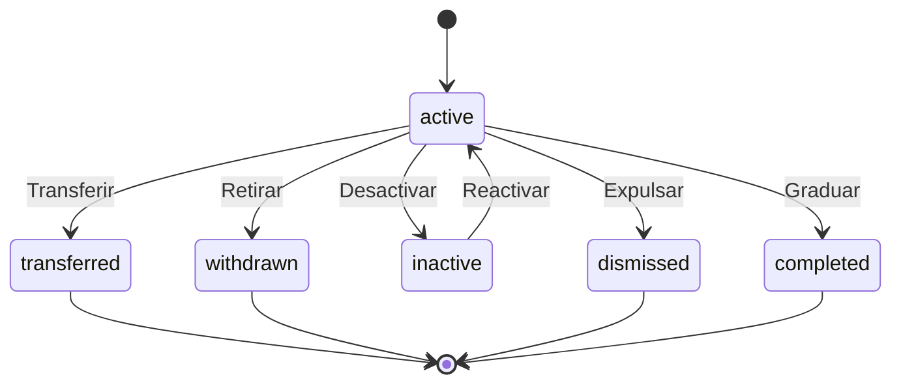

# 📚 Enrollment

> **IMPORTANTE**:
>
> 1. **Verificar siempre** los archivos relacionados:
>    - `database/migrations/2025_06_22_100130_create_enrollments_table.php` (estructura de base de datos)
>    - `app/Models/Enrollment.php` (implementación del modelo)
>    - `resources/js/types/academic/enrollment.d.ts` (tipos TypeScript)
> 2. Las migraciones son la fuente de verdad
> 3. Los modelos deben reflejar las migraciones
> 4. Los tipos TypeScript deben reflejar las migraciones y los modelos

## 📌 Ubicación

- **Tipo**: Modelo
- **Archivo Principal**: `app/Models/Enrollment.php`
- **Tabla**: `enrollments`

## 📦 Archivos Relacionados

### Migraciones

- `database/migrations/2025_06_22_100130_create_enrollments_table.php`
  - Estructura de la tabla
  - Índices compuestos para búsquedas eficientes
  - Restricción única en student_id + classroom_id + academic_year
  - Soft deletes

### Modelos Relacionados

- `app/Models/Student.php` (belongsTo)
  - Estudiante matriculado
  - Clave foránea: `student_id` (referenciando `user_id` en Student)
- `app/Models/Classroom.php` (belongsTo)
  - Aula donde está matriculado
  - Clave foránea: `classroom_id`

### Tipos TypeScript

- `resources/js/types/academic/enrollment.d.ts`
  - `type EnrollmentStatus`
  - `type Enrollment`

## 🎯 Estados del Modelo

### Diagrama de Estados



### Transiciones y Endpoints

| Estado Actual | Evento     | Nuevo Estado | Endpoint                                      | Método |
| ------------- | ---------- | ------------ | --------------------------------------------- | ------ |
| active        | graduate   | completed    | `/api/enrollments/{id}/graduate` (sugerido)   | PUT    |
| active        | transfer   | transferred  | `/api/enrollments/{id}/transfer` (sugerido)   | PUT    |
| active        | deactivate | inactive     | `/api/enrollments/{id}/deactivate` (sugerido) | PUT    |
| inactive      | activate   | active       | `/api/enrollments/{id}/activate` (sugerido)   | PUT    |
| active        | withdraw   | withdrawn    | `/api/enrollments/{id}/withdraw` (sugerido)   | PUT    |
| active        | dismiss    | dismissed    | `/api/enrollments/{id}/dismiss` (sugerido)    | PUT    |

## 🏗️ Estructura

### Base de Datos (Migraciones)

- **Tabla**: `enrollments`
- **Campos Clave**:
  - `id`: bigint - Identificador único de la matrícula
  - `student_id`: bigint - Referencia al estudiante (user_id)
  - `classroom_id`: bigint - Referencia al aula
  - `academic_year`: year - Año académico de la matrícula
  - `status`: enum - Estado actual de la matrícula
  - `enrollment_date`: date - Fecha en que se realizó la matrícula
  - `deactivated_at`: date (nullable) - Fecha de desactivación de la matrícula
  - `timestamps()`: created_at, updated_at, deleted_at

### Estados de Matrícula

- `active`: Activo (estudiante actualmente matriculado)
- `completed`: Completado (graduado o finalizado exitosamente)
- `transferred`: Transferido a otra institución
- `inactive`: Inactivo (puede regresar)
- `withdrawn`: Retirado voluntariamente
- `dismissed`: Expulsado/separado de la institución
- `failed`: Reprobado

### Índices

- `idx_enrollment_academic_year`: Índice en `academic_year`
- `idx_enrollment_status`: Índice en `status`
- `idx_enrollment_student`: Índice en `student_id`
- `idx_enrollment_classroom`: Índice en `classroom_id`
- `idx_enrollment_student_year_status`: Índice compuesto en `student_id`, `academic_year`, `status`
- `idx_enrollment_status_year`: Índice compuesto en `status`, `academic_year`

### Restricciones

- Unique constraint: `['student_id', 'classroom_id', 'academic_year']` - evita duplicados de matrícula

### Relaciones

- **Relación con Student**:
  - Tipo: belongsTo
  - Clave foránea: `student_id` (referenciando `user_id` en Student)
  - Comportamiento en cascada: cascade
- **Relación con Classroom**:
  - Tipo: belongsTo
  - Clave foránea: `classroom_id`
  - Comportamiento en cascada: restrict

## 🔄 Flujo de Datos

### Matriculación de Estudiantes

1. El administrador selecciona un estudiante y un aula
2. Especifica el año académico
3. Se crea el registro de matrícula con estado 'active' por defecto
4. La fecha de matrícula se establece automáticamente

### Cambio de Estado

1. Cuando el estudiante cambia de situación (gradúa, transfiere, etc.)
2. Se actualiza el status de la matrícula
3. Se registra la fecha de desactivación si aplica

### Consultas Comunes

- Obtener matrículas activas: `Enrollment::active()->get()`
- Obtener matrículas de un año: `Enrollment::forAcademicYear(2025)->get()`
- Obtener matrículas de un estudiante: `Enrollment::forStudent($studentId)->get()`
- Obtener matrículas de un aula: `Enrollment::forClassroom($classroomId)->get()`
- Obtener estudiantes activos en un aula: `$classroom->students()->wherePivot('status', 'active')->get()`

## 🔍 Ejemplo de Uso

```typescript
export type EnrollmentStatus = 'active' | 'inactive' | 'graduated' | 'withdrawn' | 'suspended'

export type Enrollment = BaseEntity & {
  academic_year: number
  status: EnrollmentStatus
  enrollment_date: string
  deactivated_at: string | null
  student_id: number
  classroom_id: number

  // Relaciones
  student?: Student
  classroom?: Classroom
}
```

## ⚙️ Configuración del Modelo

### Casts

- `academic_year`: `integer`
- `enrollment_date`: `date`
- `deactivated_at`: `date`

### Dates

- `enrollment_date`
- `deactivated_at`
- `created_at`
- `updated_at`
- `deleted_at`

### Fillable

Los campos que pueden ser asignados masivamente:

- `academic_year`
- `status`
- `enrollment_date`
- `student_id`
- `classroom_id`
- `deactivated_at`

### Scopes

- **scopeActive**: Filtra matrículas con estado 'active'
- **scopeForAcademicYear**: Filtra matrículas por año académico
- **scopeForStudent**: Filtra matrículas por estudiante
- **scopeForClassroom**: Filtra matrículas por aula

## ⚠️ Consideraciones

- La combinación student_id + classroom_id + academic_year es única
- Usa `cascadeOnDelete` para eliminar matrículas cuando se elimina el estudiante
- Usa `restrictOnDelete` para evitar eliminar aulas con matrículas activas
- El status por defecto es 'active'
- Usa soft deletes para permitir recuperación de matrículas eliminadas
- Los scopes facilitan consultas comunes
- El campo deactivated_at registra cuándo cambió el estado de la matrícula
