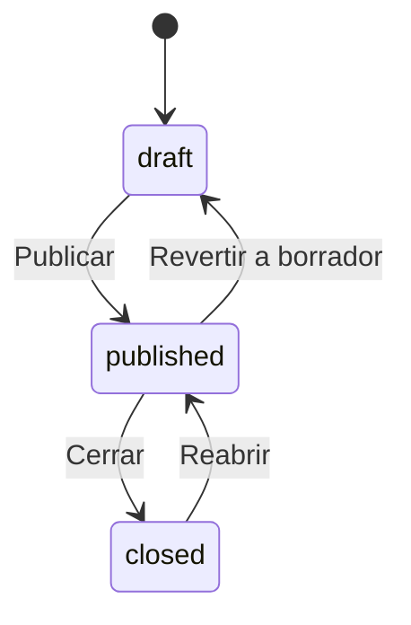

# 📚 ApplicationForm

> **IMPORTANTE**: 
> 1. **Verificar siempre** los archivos relacionados:
>    - `database/migrations/2025_06_22_100330_create_application_forms_table.php` (estructura de base de datos)
>    - `app/Models/ApplicationForm.php` (implementación del modelo)
>    - `resources/js/types/application-form/application-form.d.ts` (tipos TypeScript)
> 2. Las migraciones son la fuente de verdad
> 3. Los modelos deben reflejar las migraciones
> 4. Los tipos TypeScript deben reflejar las migraciones y los modelos

## 📌 Ubicación
- **Tipo**: Modelo
- **Archivo Principal**: `app/Models/ApplicationForm.php`
- **Tabla**: `application_forms`

## 📦 Archivos Relacionados

### Migraciones
- `database/migrations/2025_06_22_100330_create_application_forms_table.php`
  - Estructura de la tabla
  - Relaciones con claves foráneas
  - Índices y restricciones

### Modelos Relacionados
- `app/Models/Teacher.php` (belongsTo)
  - Relación con el profesor creador
  - Clave foránea: `teacher_id`
- `app/Models/LearningSession.php` (belongsTo)
  - Sesión de aprendizaje asociada
  - Clave foránea: `learning_session_id`
- `app/Models/ApplicationFormQuestion.php` (hasMany)
  - Preguntas del formulario
  - Ordenadas por campo `order`
- `app/Models/ApplicationFormResponse.php` (hasMany)
  - Respuestas de los estudiantes
  - Relación con el estudiante y sus calificaciones

### Tipos TypeScript
- `resources/js/types/application-form/application-form.d.ts`
  - `interface ApplicationForm`
  - `interface ApplicationFormQuestion`
  - Tipos relacionados con el flujo de trabajo

## 🎯 Estados del Modelo

### Diagrama de Estados


### Transiciones y Endpoints
| Estado Actual | Evento | Nuevo Estado | Endpoint | Método |
|---------------|--------|--------------|----------|--------|
| draft | publish | published | `/api/application-forms/{id}/publish` | PUT |
| published | close | closed | `/api/application-forms/{id}/close` | PUT |
| closed | reopen | published | `/api/application-forms/{id}/reopen` | PUT |
| published | revert | draft | `/api/application-forms/{id}/revert` | PUT |

## 🏗️ Estructura

### Base de Datos (Migraciones)
- **Tabla**: `application_forms`
- **Campos Clave**:
  - `id`: bigint - Identificador único
  - `name`: string - Nombre del formulario
  - `description`: text - Descripción detallada
  - `status`: enum('draft','published','closed') - Estado actual
  - `teacher_id`: foreignId - ID del profesor creador
  - `learning_session_id`: foreignId - Sesión de aprendizaje asociada
  - `start_date`: timestamp - Fecha de inicio de disponibilidad
  - `end_date`: timestamp - Fecha de cierre
  - `timestamps()`: created_at, updated_at, deleted_at

### Relaciones
- **Relación con Teacher**:
  - Tipo: belongsTo
  - Clave foránea: `teacher_id`
  - Comportamiento en cascada: null on delete
- **Relación con LearningSession**:
  - Tipo: belongsTo
  - Clave foránea: `learning_session_id`
  - Comportamiento en cascada: null on delete
- **Relación con ApplicationFormQuestion**:
  - Tipo: hasMany
  - Clave foránea: `application_form_id`
  - Comportamiento en cascada: delete
- **Relación con ApplicationFormResponse**:
  - Tipo: hasMany
  - Clave foránea: `application_form_id`
  - Comportamiento en cascada: restrict

## 🔄 Flujo de Datos
1. **Creación**:
   - El profesor crea un nuevo formulario
   - Se validan los datos de entrada
   - Se asigna automáticamente el estado 'draft'

2. **Edición**:
   - Solo permitido en estado 'draft' o 'closed'
   - Se pueden agregar/eliminar preguntas
   - Se actualizan metadatos del formulario

3. **Publicación**:
   - Transición a estado 'published'
   - Se habilita para que los estudiantes respondan
   - Se validan que todas las preguntas sean válidas

4. **Cierre**:
   - Transición a estado 'closed'
   - Los estudiantes ya no pueden enviar respuestas
   - Los profesores pueden ver resultados

5. **Reapertura**:
   - Vuelve a estado 'published'
   - Los estudiantes pueden continuar respondiendo

## 🔍 Ejemplo de Uso
```typescript
// Ejemplo de tipo TypeScript relacionado
interface ApplicationForm {
  id: number;
  name: string;
  description: string;
  status: 'draft' | 'published' | 'closed';
  start_date: string;
  end_date: string;
  questions: ApplicationFormQuestion[];
  teacher: {
    id: number;
    name: string;
    email: string;
  };
  learning_session: {
    id: number;
    name: string;
  };
}
```

[SECCIÓN OPCIONAL: ⚙️ Configuración]
- `config/application-form.php` - Configuración de límites y restricciones
- Variables de entorno para fechas por defecto

[SECCIÓN OPCIONAL: ⚠️ Consideraciones]
- Validar que las fechas de inicio/fin sean coherentes
- Verificar permisos antes de transiciones de estado
- Considerar impacto en rendimiento con muchos formularios activos

#### 🔑 Claves
- **Primaria**: `id` (bigint autoincremental)
- **Foráneas**:
  - `teacher_id` → `teachers.user_id` (cascadeOnDelete)
  - `learning_session_id` → `learning_sessions.id` (restrictOnDelete)
- **Índices**:
  - `idx_application_form_status` (status)
  - `idx_application_form_start_date` (start_date)
  - `idx_application_form_end_date` (end_date)
  - `idx_application_form_learning_session` (learning_session_id)
  - `idx_application_form_scheduling` (status, start_date, end_date)

#### 📋 Columnas
| Columna | Tipo | Nulo | Default | Descripción |
|---|---|---|---|---|
| id | bigint | No | Auto | Identificador único del formulario de aplicación |
| name | string | No | - | Nombre del formulario de aplicación |
| description | text | No | - | Descripción detallada del formulario |
| status | enum | No | 'draft' | Estado: draft, scheduled, active, inactive, archived |
| score_max | decimal(10,2) | No | - | Puntuación máxima posible en este formulario |
| start_date | datetime | No | - | Fecha y hora de inicio de disponibilidad |
| end_date | datetime | No | - | Fecha y hora de finalización de disponibilidad |
| teacher_id | bigint | No | - | Referencia al profesor (user_id en teachers) |
| learning_session_id | bigint | No | - | Referencia a la sesión de aprendizaje relacionada |
| created_at | timestamp | No | CURRENT_TIMESTAMP | Fecha de creación |
| updated_at | timestamp | No | CURRENT_TIMESTAMP | Fecha de actualización |
| deleted_at | timestamp | Sí | NULL | Fecha de eliminación (soft delete) |

## 🔍 Scopes y Métodos de Consulta

### Scopes
- `scopeActive(Builder $query)`: Filtra formularios actualmente activos (status = 'active' y dentro del rango de fechas)
- `scopeForTeacher(Builder $query, int $teacherId)`: Filtra formularios por profesor

### Métodos de Instancia
- `isActive(): bool` - Verifica si el formulario está actualmente activo
- `isUpcoming(): bool` - Verifica si el formulario está programado para el futuro
- `isExpired(): bool` - Verifica si el formulario ha expirado

## 🛠️ TypeScript Types

### Tipos Principales

**ApplicationFormStatus**: `'draft' | 'scheduled' | 'active' | 'inactive' | 'archived'`

**ApplicationForm**: Interfaz que representa un formulario de aplicación en el frontend.

```typescript
export interface ApplicationForm {
  id: number;
  name: string;
  description: string;
  start_date: string;
  end_date: string;
  score_max: number;
  status: ApplicationFormStatus;
  teacher_id: number;
  learning_session_id: number | null;
  created_at: string;
  updated_at: string;
  deleted_at: string | null;

  // Relaciones
  teacher: User;
  learning_session: LearningSession | null;
  questions: ApplicationFormQuestion[];
  responses: ApplicationFormResponse[];
}
```

### Tipos para API

**ApplicationFormFilters**: Define los filtros disponibles para buscar formularios.

```typescript
export interface ApplicationFormFilters {
  search?: string;
  status?: ApplicationFormStatus | ApplicationFormStatus[];
  teacher_id?: number;
  learning_session_id?: number | null;
  starts_before?: string;
  starts_after?: string;
  ends_before?: string;
  ends_after?: string;
  with_trashed?: boolean;
  only_trashed?: boolean;
  include?: Array<'teacher' | 'learning_session' | 'questions' | 'responses'>;
  sort_by?: 'name' | 'start_date' | 'end_date' | 'created_at' | 'updated_at';
  sort_order?: 'asc' | 'desc';
}
```

## 🔗 Relaciones (Eloquent)

### teacher (BelongsTo)
- **Modelo**: `Teacher`
- **Clave foránea**: `teacher_id`

### learningSession (BelongsTo)
- **Modelo**: `LearningSession`
- **Clave foránea**: `learning_session_id`

### questions (HasMany)
- **Modelo**: `ApplicationFormQuestion`
- **Clave foránea**: `application_form_id`
- **Nota**: Las preguntas se ordenan por la columna `order`.

### responses (HasMany)
- **Modelo**: `ApplicationFormResponse`
- **Clave foránea**: `application_form_id`

## ⚙️ Métodos y Scopes Principales

### Scopes

#### scopeActive(Builder $query)
- Filtra los formularios cuyo estado es `active` y la fecha actual está dentro del rango de `start_date` y `end_date`.

#### scopeForTeacher(Builder $query, int $teacherId)
- Filtra los formularios que pertenecen a un profesor específico.

### Métodos

#### isActive(): bool
- Devuelve `true` si el formulario está activo y dentro de las fechas de disponibilidad.

#### isUpcoming(): bool
- Devuelve `true` si el formulario está programado (`scheduled`) y su fecha de inicio es futura.

#### isExpired(): bool
- Devuelve `true` si la fecha de finalización del formulario ya ha pasado.

## Uso con API

### Ejemplo de Respuesta JSON
```json
{
  "id": 1,
  "name": "Evaluación de Álgebra Básica",
  "description": "Cubre los temas de ecuaciones lineales y polinomios.",
  "status": "active",
  "score_max": 100.00,
  "start_date": "2025-08-01T09:00:00.000000Z",
  "end_date": "2025-08-10T23:59:59.000000Z",
  "teacher_id": 4,
  "learning_session_id": 15,
  "created_at": "2025-07-20T11:00:00.000000Z",
  "updated_at": "2025-07-21T15:30:00.000000Z"
}
```

## Buenas Prácticas
1. **Validación**: Utilizar `Form Requests` en los controladores para validar los datos de entrada al crear o actualizar un formulario.
2. **Autorización**: Implementar `Policies` para asegurar que solo los usuarios autorizados (ej. el profesor propietario) puedan modificar o eliminar un formulario.
3. **Rendimiento**: Cargar relaciones de manera selectiva usando `with()` para evitar el problema N+1.
