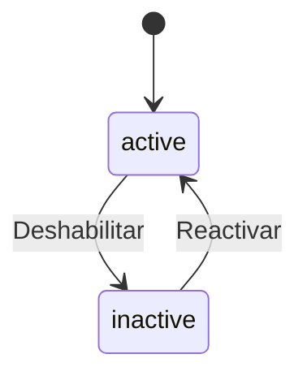

# 📚 ApplicationFormQuestion

> **IMPORTANTE**: 
> 1. **Verificar siempre** los archivos relacionados:
>    - `database/migrations/2025_06_22_100350_create_application_form_questions_table.php` (estructura de base de datos)
>    - `app/Models/ApplicationFormQuestion.php` (implementación del modelo)
>    - `resources/js/types/application-form/form/application-form-question.d.ts` (tipos TypeScript)
> 2. Las migraciones son la fuente de verdad
> 3. Los modelos deben reflejar las migraciones
> 4. Los tipos TypeScript deben reflejar las migraciones y los modelos

## 📌 Ubicación
- **Tipo**: Modelo (Tabla Pivot)
- **Archivo Principal**: `app/Models/ApplicationFormQuestion.php`
- **Tabla**: `application_form_questions`

## 📦 Archivos Relacionados

### Migraciones
- `database/migrations/2025_06_22_100350_create_application_form_questions_table.php`
  - Estructura de la tabla
  - Relaciones con claves foráneas
  - Índices y restricciones

### Modelos Relacionados
- `app/Models/ApplicationForm.php` (belongsTo)
  - Formulario contenedor
  - Clave foránea: `application_form_id`
- `app/Models/Question.php` (belongsTo)
  - Pregunta base con configuración
  - Clave foránea: `question_id`
- `app/Models/ApplicationFormResponseQuestion.php` (hasMany)
  - Respuestas de los estudiantes
  - Relación con las opciones seleccionadas

### Tipos TypeScript
- `resources/js/types/application-form/form/application-form-question.d.ts`
  - `interface ApplicationFormQuestion`
  - Tipos relacionados con la configuración de preguntas

## 🎯 Estados del Modelo

### Diagrama de Estados


### Transiciones y Endpoints
| Estado Actual | Evento | Nuevo Estado | Endpoint | Método |
|---------------|--------|--------------|----------|--------|
| active | disable | inactive | `/api/application-form-questions/{id}/disable` | PUT |
| inactive | enable | active | `/api/application-form-questions/{id}/enable` | PUT |

## 🏗️ Estructura

### Base de Datos (Migraciones)
- **Tabla**: `application_form_questions`
- **Campos Clave**:
  - `id`: bigint - Identificador único
  - `application_form_id`: foreignId - Referencia al formulario
  - `question_id`: foreignId - Referencia a la pregunta base
  - `order`: integer - Orden de aparición en el formulario
  - `score`: decimal - Puntuación asignada a la pregunta
  - `is_required`: boolean - Si la pregunta es obligatoria
  - `timestamps()`: created_at, updated_at, deleted_at

### Relaciones
- **Relación con ApplicationForm**:
  - Tipo: belongsTo
  - Clave foránea: `application_form_id`
  - Comportamiento en cascada: delete
- **Relación con Question**:
  - Tipo: belongsTo
  - Clave foránea: `question_id`
  - Comportamiento en cascada: restrict
- **Relación con ApplicationFormResponseQuestion**:
  - Tipo: hasMany
  - Clave foránea: `application_form_question_id`
  - Comportamiento en cascada: delete

## 🔄 Flujo de Datos
1. **Asignación de Preguntas**:
   - Se asigna una pregunta existente a un formulario
   - Se configura el orden y puntuación
   - Se establece si es obligatoria

2. **Edición de Configuración**:
   - Se pueden modificar el orden y puntuación
   - Se puede marcar/desmarcar como obligatoria
   - No se puede cambiar la pregunta base (crear nueva relación en su lugar)

3. **Eliminación**:
   - Elimina la relación pregunta-formulario
   - No afecta a la pregunta base
   - Elimina respuestas asociadas (en cascada)

## 🔍 Ejemplo de Uso
```typescript
// Ejemplo de tipo TypeScript relacionado
interface ApplicationFormQuestion {
  id: number;
  application_form_id: number;
  question_id: number;
  order: number;
  score: number;
  is_required: boolean;
  question: {
    id: number;
    name: string;
    description: string;
    question_type: {
      id: number;
      name: string;
    };
    options: Array<{
      id: number;
      value: string;
      is_correct: boolean;
    }>;
  };
}
```

[SECCIÓN OPCIONAL: ⚙️ Configuración]
- Puntuación por defecto para preguntas
- Ordenamiento automático al agregar nuevas preguntas

[SECCIÓN OPCIONAL: ⚠️ Consideraciones]
- No modificar la pregunta base después de creadas respuestas
- Verificar coherencia en puntuación con el tipo de pregunta
- Considerar impacto en estadísticas al modificar puntuaciones
- **Primaria**: `id`
- **Foráneas**:
  - `application_form_id` → `application_forms.id` (cascadeOnDelete)
  - `question_id` → `questions.id` (restrictOnDelete)
- **Índices**:
  - `uq_application_form_question` (application_form_id, question_id) - Único
  - `idx_application_form_question_application_form` (application_form_id)
  - `idx_application_form_question_question` (question_id)
  - `idx_application_form_question_application_form_order` (application_form_id, order)

#### 📋 Columnas
| Columna | Tipo | Nulo | Default | Descripción |
|---|---|---|---|---|
| id | bigint | No | Auto | ID único de la relación |
| order | unsignedInteger | No | - | Orden de la pregunta en el formulario |
| score | decimal(10,2) | No | 0 | Puntaje máximo de la pregunta |
| points_store | decimal(10,2) | No | 0 | Puntos para la tienda al responder correctamente |
| application_form_id | bigint | No | - | Referencia al formulario |
| question_id | bigint | No | - | Referencia a la pregunta |
| created_at | timestamp | No | - | Fecha de creación |
| updated_at | timestamp | No | - | Fecha de actualización |

## 🔍 Scopes y Métodos de Consulta

### Scopes
- `scopeForApplicationForm(Builder $query, int $applicationFormId)`: Filtra preguntas por ID de formulario
- `scopeOrdered(Builder $query)`: Ordena las preguntas por el campo `order`
- `scopeWithQuestion(Builder $query, int $questionId)`: Filtra por ID de pregunta base

### Métodos de Instancia
- `isCorrectAnswer(array $selectedOptions): bool` - Verifica si las opciones seleccionadas son correctas para esta pregunta

## 🔗 Relaciones (Eloquent)

### applicationForm (BelongsTo)
- **Modelo**: `ApplicationForm`
- **Clave foránea**: `application_form_id`
- **Soft Delete**: Incluye registros eliminados (`withTrashed`)

### question (BelongsTo)
- **Modelo**: `Question`
- **Soft Delete**: Incluye registros eliminados (`withTrashed`)
- **Clave foránea**: `question_id`

### responseQuestions (HasMany)
- **Modelo**: `ApplicationFormResponseQuestion`
- **Clave foránea**: `application_form_question_id`

## 🛠️ TypeScript Types

### Interfaz `ApplicationFormQuestion`
```typescript
interface ApplicationFormQuestion {
  id: number;
  order: number;
  score: number;
  points_store: number;
  application_form_id: number;
  question_id: number;
  created_at: string;
  updated_at: string;

  // Relaciones (cargadas opcionalmente)
  applicationForm?: ApplicationForm;
  question?: Question;
  responseQuestions?: ApplicationFormResponseQuestion[];
}
```
