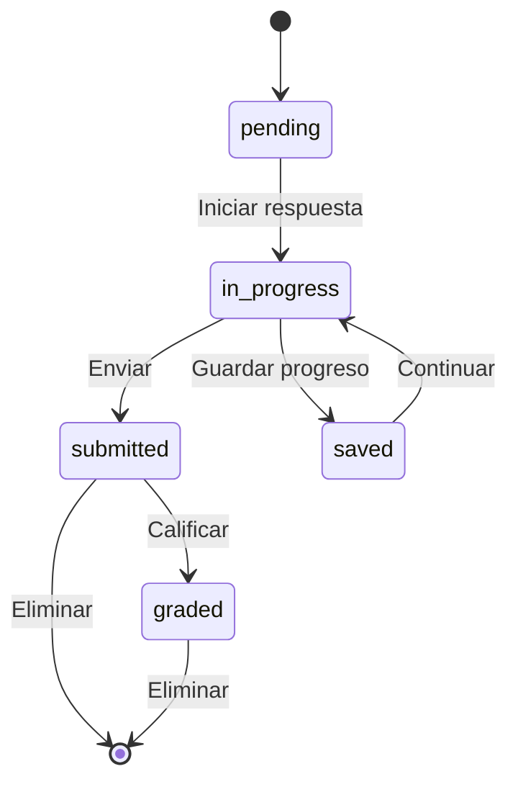

# 📚 ApplicationFormResponse

> **IMPORTANTE**: 
> 1. **Verificar siempre** los archivos relacionados:
>    - `database/migrations/2025_06_22_100340_create_application_form_responses_table.php` (estructura de base de datos)
>    - `app/Models/ApplicationFormResponse.php` (implementación del modelo)
>    - `resources/js/types/application-form/form/response/application-form-response.d.ts` (tipos TypeScript)
> 2. Las migraciones son la fuente de verdad
> 3. Los modelos deben reflejar las migraciones
> 4. Los tipos TypeScript deben reflejar las migraciones y los modelos

## 📌 Ubicación
- **Tipo**: Modelo
- **Archivo Principal**: `app/Models/ApplicationFormResponse.php`
- **Tabla**: `application_form_responses`

## 📦 Archivos Relacionados

### Migraciones
- `database/migrations/2025_06_22_100340_create_application_form_responses_table.php`
  - Estructura de la tabla
  - Relaciones con claves foráneas
  - Índices y restricciones

### Modelos Relacionados
- `app/Models/ApplicationForm.php` (belongsTo)
  - Formulario asociado
  - Clave foránea: `application_form_id`
- `app/Models/User.php` (belongsTo - Student)
  - Estudiante que respondió
  - Clave foránea: `student_id`
- `app/Models/ApplicationFormResponseQuestion.php` (hasMany)
  - Respuestas individuales a preguntas
  - Relación con opciones seleccionadas

### Tipos TypeScript
- `resources/js/types/application-form/form/response/application-form-response.d.ts`
  - `interface ApplicationFormResponse`
  - Tipos relacionados con el estado de respuestas

## 🎯 Estados del Modelo

### Diagrama de Estados


### Transiciones y Endpoints
| Estado Actual | Evento | Nuevo Estado | Endpoint | Método |
|---------------|--------|--------------|----------|--------|
| pending | start | in_progress | `/api/responses/{id}/start` | PUT |
| in_progress | save | saved | `/api/responses/{id}/save` | PUT |
| in_progress | submit | submitted | `/api/responses/{id}/submit` | PUT |
| submitted | grade | graded | `/api/responses/{id}/grade` | PUT |

## 🏗️ Estructura

### Base de Datos (Migraciones)
- **Tabla**: `application_form_responses`
- **Campos Clave**:
  - `id`: bigint - Identificador único
  - `application_form_id`: foreignId - Referencia al formulario
  - `student_id`: foreignId - Referencia al estudiante
  - `score`: decimal - Puntuación total (calculada)
  - `status`: enum('pending','in_progress','submitted','graded') - Estado actual
  - `started_at`: timestamp - Cuándo comenzó la respuesta
  - `submitted_at`: timestamp - Cuándo se envió
  - `graded_at`: timestamp - Cuándo se calificó
  - `timestamps()`: created_at, updated_at, deleted_at

### Relaciones
- **Relación con ApplicationForm**:
  - Tipo: belongsTo
  - Clave foránea: `application_form_id`
  - Comportamiento en cascada: restrict
- **Relación con User (Student)**:
  - Tipo: belongsTo
  - Clave foránea: `student_id`
  - Comportamiento en cascada: restrict
- **Relación con ApplicationFormResponseQuestion**:
  - Tipo: hasMany
  - Clave foránea: `response_id`
  - Comportamiento en cascada: delete

## 🔄 Flujo de Datos
1. **Inicio de Respuesta**:
   - El estudiante inicia un nuevo intento
   - Se crea un registro con estado 'in_progress'
   - Se registra la hora de inicio

2. **Guardado de Progreso**:
   - Se guardan las respuestas parciales
   - Se actualiza el timestamp de modificación
   - El estado puede permanecer 'in_progress' o cambiar a 'saved'

3. **Envío de Respuestas**:
   - Se validan todas las respuestas requeridas
   - Se calcula la puntuación preliminar
   - El estado cambia a 'submitted'
   - Se registra la hora de envío

4. **Calificación (opcional)**:
   - El profesor califica las respuestas abiertas
   - Se actualiza la puntuación final
   - El estado cambia a 'graded'
   - Se registra la hora de calificación

## 🔍 Ejemplo de Uso
```typescript
// Ejemplo de tipo TypeScript relacionado
interface ApplicationFormResponse {
  id: number;
  application_form_id: number;
  student_id: number;
  score: number | null;
  status: 'pending' | 'in_progress' | 'submitted' | 'graded';
  started_at: string | null;
  submitted_at: string | null;
  graded_at: string | null;
  response_questions: Array<{
    id: number;
    question_id: number;
    explanation: string | null;
    score: number | null;
    selected_options: Array<{
      id: number;
      question_option_id: number;
      value: string;
    }>;
  }>;
  student: {
    id: number;
    name: string;
    email: string;
  };
}
```

[SECCIÓN OPCIONAL: ⚙️ Configuración]
- Límite de intentos por formulario
- Tiempo máximo para completar un formulario
- Configuración de guardado automático

[SECCIÓN OPCIONAL: ⚠️ Consideraciones]
- Manejo de respuestas fuera de tiempo
- Validación de integridad de datos
- Copias de seguridad de respuestas en progreso
- **Primaria**: `id`
- **Foráneas**:
  - `application_form_id` → `application_forms.id` (restrictOnDelete)
  - `student_id` → `students.user_id` (restrictOnDelete)
- **Índices**:
  - `uq_application_form_response` (application_form_id, student_id) - Único
  - `idx_application_form_responses_student` (student_id)
  - `idx_application_form_responses_form` (application_form_id)
  - `idx_application_form_response_status` (status)
  - `idx_application_form_response_score` (score)

#### 📋 Columnas
| Columna | Tipo | Nulo | Default | Descripción |
|---|---|---|---|---|
| id | bigint | No | Auto | ID único de la respuesta |
| score | decimal(10,2) | No | 0 | Puntuación obtenida |
| status | enum | No | 'pending' | Estado de la respuesta (pending, in progress, etc.) |
| started_at | timestamp | Sí | NULL | Fecha de inicio |
| submitted_at | timestamp | Sí | NULL | Fecha de envío |
| graded_at | timestamp | Sí | NULL | Fecha de calificación |
| application_form_id | bigint | No | - | Referencia al formulario |
| student_id | bigint | No | - | Referencia al estudiante |
| created_at | timestamp | No | - | Fecha de creación |
| updated_at | timestamp | No | - | Fecha de actualización |
| deleted_at | timestamp | Sí | NULL | Fecha de eliminación (soft delete) |

## 🔍 Scopes y Métodos de Consulta

### Scopes
- `scopeForApplicationForm(Builder $query, int $applicationFormId)`: Filtra respuestas por ID de formulario
- `scopeForStudent(Builder $query, int $studentId)`: Filtra respuestas por ID de estudiante
- `scopeWithStatus(Builder $query, string $status)`: Filtra respuestas por estado
- `scopeGraded(Builder $query)`: Filtra respuestas ya calificadas
- `scopeSubmitted(Builder $query)`: Filtra respuestas ya enviadas

### Métodos de Instancia
- `markAsStarted()`: Marca la respuesta como iniciada
- `markAsSubmitted()`: Marca la respuesta como enviada
- `calculateScore(): float`: Calcula el puntaje basado en las respuestas correctas
- `isGraded(): bool`: Verifica si la respuesta ha sido calificada
- `isLate(): bool`: Verifica si la respuesta fue enviada después de la fecha límite
- `updateTotalScore(): bool`: Actualiza el puntaje total sumando los puntajes de todas las preguntas

## 🔗 Relaciones (Eloquent)

### applicationForm (BelongsTo)
- **Modelo**: `ApplicationForm`
- **Clave foránea**: `application_form_id`
- **Soft Delete**: Incluye registros eliminados (`withTrashed`)
- **Carga ansiosa**: Incluye registros eliminados (`withTrashed`).

### student (BelongsTo)
- **Modelo**: `Student`
- **Clave foránea**: `student_id` (referencia a `user_id` en la tabla `students`)
- **Soft Delete**: Incluye registros eliminados (`withTrashed`).

### responseQuestions (HasMany)
- **Modelo**: `ApplicationFormResponseQuestion`
- **Clave foránea**: `application_form_response_id`
- **Relación**: Una respuesta puede tener múltiples respuestas a preguntas individuales.

## 🛠️ Métodos y Scopes

### Scopes
- `scopeForApplicationForm(int $formId)`: Filtra por un formulario de aplicación específico.
- `scopeForStudent(int $studentId)`: Filtra por un estudiante específico.
- `scopeWithStatus(string $status)`: Filtra por un estado específico.
- `scopeGraded()`: Filtra respuestas que han sido calificadas.
- `scopeSubmitted()`: Filtra respuestas que han sido enviadas.

### Métodos Principales
- `markAsStarted()`: Marca la respuesta como iniciada, actualizando `started_at` y el estado a `in progress`.
- `markAsSubmitted()`: Marca la respuesta como enviada, actualizando `submitted_at` y el estado a `submitted`.
- `calculateScore()`: Calcula la puntuación sumando los puntajes de las respuestas correctas.
- `updateTotalScore()`: Actualiza la puntuación total de la respuesta sumando los puntajes de `ApplicationFormResponseQuestion`.
- `isGraded()`: Devuelve `true` si la respuesta ha sido calificada.
- `isLate()`: Devuelve `true` si la respuesta fue enviada después de la fecha de finalización del formulario.

## 🛠️ TypeScript Types

### Interfaz `ApplicationFormResponse`
```typescript
export interface ApplicationFormResponse {
  id: number;
  application_form_id: number;
  student_id: number;
  status: ApplicationFormResponseStatus;
  score: number;
  started_at: string | null;
  submitted_at: string | null;
  graded_at: string | null;
  created_at: string;
  updated_at: string;
  deleted_at: string | null;

  // Relaciones
  student: Student;
  application_form: ApplicationForm;
  response_questions: ApplicationFormResponseQuestion[];
}
```

### Tipo `ApplicationFormResponseStatus`
```typescript
export type ApplicationFormResponseStatus =
  | 'pending'
  | 'in progress'
  | 'submitted'
  | 'in review'
  | 'graded'
  | 'returned'
  | 'late';
```
