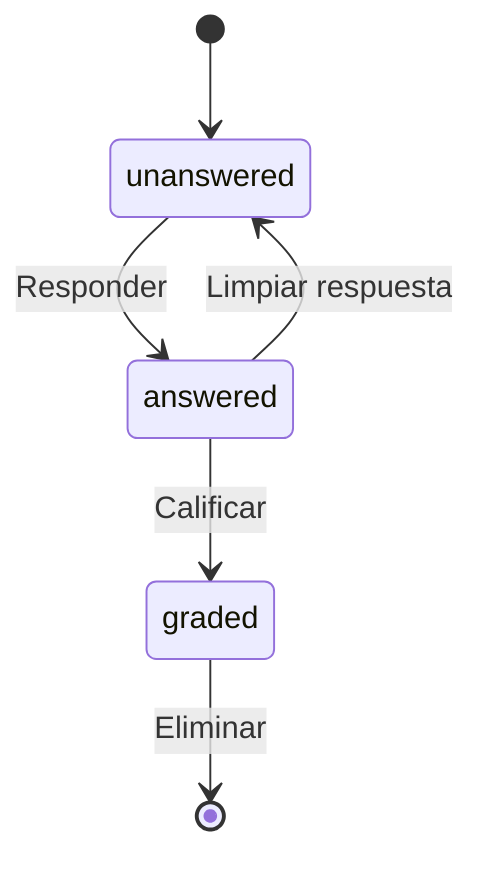

# 📚 ApplicationFormResponseQuestion

> **IMPORTANTE**: 
> 1. **Verificar siempre** los archivos relacionados:
>    - `database/migrations/2025_06_22_100360_create_application_form_response_questions_table.php` (estructura de base de datos)
>    - `app/Models/ApplicationFormResponseQuestion.php` (implementación del modelo)
>    - `resources/js/types/application-form/form/response/application-form-response-question.d.ts` (tipos TypeScript)
> 2. Las migraciones son la fuente de verdad
> 3. Los modelos deben reflejar las migraciones
> 4. Los tipos TypeScript deben reflejar las migraciones y los modelos

## 📌 Ubicación
- **Tipo**: Modelo
- **Archivo Principal**: `app/Models/ApplicationFormResponseQuestion.php`
- **Tabla**: `application_form_response_questions`

## 📦 Archivos Relacionados

### Migraciones
- `database/migrations/2025_06_22_100360_create_application_form_response_questions_table.php`
  - Estructura de la tabla
  - Relaciones con claves foráneas
  - Índices y restricciones

### Modelos Relacionados
- `app/Models/ApplicationFormResponse.php` (belongsTo)
  - Respuesta general del formulario
  - Clave foránea: `response_id`
- `app/Models/ApplicationFormQuestion.php` (belongsTo)
  - Pregunta del formulario
  - Clave foránea: `question_id`
- `app/Models/QuestionOption.php` (belongsTo)
  - Opción principal seleccionada
  - Clave foránea: `question_option_id` (opcional)
- `app/Models/ApplicationFormResponseQuestionOption.php` (hasMany)
  - Opciones seleccionadas para preguntas complejas
  - Relación uno a muchos

### Tipos TypeScript
- `resources/js/types/application-form/form/response/application-form-response-question.d.ts`
  - `interface ApplicationFormResponseQuestion`
  - Tipos relacionados con respuestas a preguntas

## 🎯 Estados del Modelo

### Diagrama de Estados


### Transiciones y Endpoints
| Estado Actual | Evento | Nuevo Estado | Endpoint | Método |
|---------------|--------|--------------|----------|--------|
| unanswered | answer | answered | `/api/responses/{id}/questions/{questionId}` | PUT |
| answered | clear | unanswered | `/api/responses/{id}/questions/{questionId}/clear` | DELETE |
| answered | grade | graded | `/api/responses/{id}/questions/{questionId}/grade` | PUT |

## 🏗️ Estructura

### Base de Datos (Migraciones)
- **Tabla**: `application_form_response_questions`
- **Campos Clave**:
  - `id`: bigint - Identificador único
  - `response_id`: foreignId - Referencia a la respuesta del formulario
  - `question_id`: foreignId - Referencia a la pregunta
  - `question_option_id`: foreignId - Opción seleccionada (para preguntas simples)
  - `explanation`: text - Explicación del estudiante (opcional)
  - `score`: decimal - Puntuación obtenida (si aplica)
  - `timestamps()`: created_at, updated_at, deleted_at

### Relaciones
- **Relación con ApplicationFormResponse**:
  - Tipo: belongsTo
  - Clave foránea: `response_id`
  - Comportamiento en cascada: delete
- **Relación con ApplicationFormQuestion**:
  - Tipo: belongsTo
  - Clave foránea: `question_id`
  - Comportamiento en cascada: restrict
- **Relación con QuestionOption**:
  - Tipo: belongsTo
  - Clave foránea: `question_option_id`
  - Comportamiento en cascada: nullOnDelete
- **Relación con ApplicationFormResponseQuestionOption**:
  - Tipo: hasMany
  - Clave foránea: `response_question_id`
  - Comportamiento en cascada: delete

## 🔄 Flujo de Datos
1. **Creación de Respuesta**:
   - Se crea un registro cuando un estudiante responde una pregunta
   - Se asocia a la respuesta general del formulario
   - Se registran las opciones seleccionadas

2. **Actualización de Respuesta**:
   - El estudiante puede modificar su respuesta
   - Se actualizan las opciones seleccionadas
   - Se registra la explicación si es requerida

3. **Calificación**:
   - El profesor califica la respuesta
   - Se asigna un puntaje y retroalimentación
   - Se actualiza el estado a 'graded'

## 🔍 Ejemplo de Uso
```typescript
// Ejemplo de tipo TypeScript relacionado
interface ApplicationFormResponseQuestion {
  id: number;
  response_id: number;
  question_id: number;
  question_option_id: number | null;
  explanation: string | null;
  score: number | null;
  selected_options: Array<{
    id: number;
    question_option_id: number;
    value: string;
    is_correct: boolean;
  }>;
  question: {
    id: number;
    name: string;
    description: string;
    question_type: {
      id: number;
      name: string;
      slug: 'multiple_choice' | 'true_false' | 'matching' | 'ordering';
    };
    options: Array<{
      id: number;
      text: string;
      is_correct: boolean;
      pair_key?: string;
      pair_side?: 'left' | 'right';
      correct_order?: number;
    }>;
  };
}
```

[SECCIÓN OPCIONAL: ⚙️ Configuración]
- Validación de respuestas según el tipo de pregunta
- Configuración de puntuación automática
- Límites de caracteres para explicaciones

[SECCIÓN OPCIONAL: ⚠️ Consideraciones]
- Manejo de respuestas parciales
- Validación de opciones según el tipo de pregunta
- Cálculo de puntuación para diferentes tipos de preguntas

#### 🔑 Claves
- **Primaria**: `id`
- **Foráneas**:
  - `application_form_response_id` → `application_form_responses.id` (cascadeOnDelete)
  - `application_form_question_id` → `application_form_questions.id` (cascadeOnDelete)
  - `question_option_id` → `question_options.id` (nullOnDelete)
- **Índices**:
  - `uq_application_form_response_questions` (application_form_response_id, application_form_question_id) - Único
  - `idx_afrq_response` (application_form_response_id)
  - `idx_afrq_question` (application_form_question_id)
  - `idx_afrq_option` (question_option_id)

#### 📋 Columnas
| Columna | Tipo | Nulo | Default | Descripción |
|---|---|---|---|---|
| id | bigint | No | Auto | ID único de la respuesta a la pregunta |
| explanation | text | Sí | NULL | Justificación del estudiante |
| score | decimal(10,2) | No | 0 | Puntaje obtenido en la pregunta |
| points_store | decimal(10,2) | No | 0 | Puntos de tienda obtenidos |
| application_form_response_id | bigint | No | - | Referencia a la respuesta del formulario |
| application_form_question_id | bigint | No | - | Referencia a la pregunta del formulario |
| question_option_id | bigint | Sí | NULL | Opción principal seleccionada (para compatibilidad) |
| selected_order | int | Sí | NULL | Orden seleccionado (para preguntas de ordenamiento) |
| paired_with_option_id | bigint | Sí | NULL | ID de la opción emparejada (para preguntas de emparejamiento) |
| created_at | timestamp | No | - | Fecha de creación |
| updated_at | timestamp | No | - | Fecha de actualización |
| deleted_at | timestamp | Sí | NULL | Fecha de eliminación (soft delete) |

## 🔍 Scopes y Métodos de Consulta

### Scopes
- `scopeForResponse(Builder $query, int $responseId)`: Filtra respuestas por ID de respuesta
- `scopeForQuestion(Builder $query, int $questionId)`: Filtra respuestas por ID de pregunta
- `scopeWithOption(Builder $query, int $optionId)`: Filtra respuestas que incluyan una opción específica

### Métodos de Instancia
- `getIsCorrectAttribute(): bool`: Determina si la respuesta es correcta (basado en la opción principal)
- `updateScore(): bool`: Calcula y actualiza el puntaje basado en las opciones seleccionadas
- `syncSelectedOptions(array $selectedOptions): self`: Sincroniza las opciones seleccionadas para esta respuesta

## 🔗 Relaciones (Eloquent)

### applicationFormResponse (BelongsTo)
- **Modelo**: `ApplicationFormResponse`
- **Clave foránea**: `application_form_response_id`
- **Soft Delete**: Incluye registros eliminados (`withTrashed`)

### applicationFormQuestion (BelongsTo)
- **Modelo**: `ApplicationFormQuestion`
- **Clave foránea**: `application_form_question_id`

### questionOption (BelongsTo)
- **Modelo**: `QuestionOption`
- **Clave foránea**: `question_option_id`
- **Soft Delete**: Incluye registros eliminados (`withTrashed`)
- **Descripción**: Opción principal seleccionada (para preguntas de opción única).

### selectedOptions (HasMany)
- **Modelo**: `ApplicationFormResponseQuestionOption`
- **Clave foránea**: `application_form_response_question_id`
- **Relación**: Una respuesta puede tener múltiples opciones seleccionadas (para preguntas de opción múltiple, ordenamiento y emparejamiento)
- **Descripción**: Colección de todas las opciones seleccionadas, usada para preguntas de opción múltiple, ordenamiento y emparejamiento.

## 🛠️ Métodos y Scopes

### Scopes
- `scopeForResponse(int $responseId)`: Filtra por una respuesta de formulario específica.
- `scopeForQuestion(int $questionId)`: Filtra por una pregunta de formulario específica.
- `scopeWithOption(int $optionId)`: Filtra por una opción seleccionada específica.

### Métodos Principales
- `getIsCorrectAttribute()`: Accesor que determina si la `questionOption` seleccionada es correcta.
- `updateScore()`: Calcula y actualiza el puntaje de la pregunta basado en el tipo de pregunta y las opciones seleccionadas.
- `syncSelectedOptions(array $options)`: Sincroniza las opciones seleccionadas en la tabla `application_form_response_question_options`. Maneja la lógica para crear, actualizar y eliminar opciones para preguntas complejas (múltiples, ordenamiento, emparejamiento).

## 🛠️ TypeScript Types

### Interfaz `ApplicationFormResponseQuestion`
```typescript
export interface ApplicationFormResponseQuestion {
  id: number;
  application_form_response_id: number;
  application_form_question_id: number;
  question_option_id: number | null;
  explanation: string | null;
  score: number;
  points_store: number;
  status: ApplicationFormResponseQuestionStatus;
  created_at: string;
  updated_at: string;
  deleted_at: string | null;

  // Relaciones
  application_form_question: ApplicationFormQuestion;
  selected_options: ApplicationFormResponseQuestionOption[];
}
```
