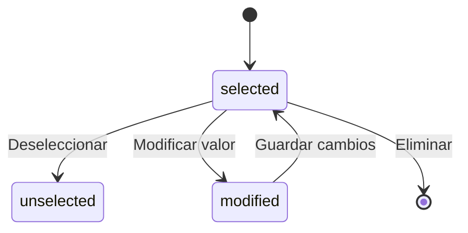

# 📚 ApplicationFormResponseQuestionOption

> **IMPORTANTE**: 
> 1. **Verificar siempre** los archivos relacionados:
>    - `database/migrations/2025_06_22_100370_create_application_form_response_question_options_table.php` (estructura de base de datos)
>    - `app/Models/ApplicationFormResponseQuestionOption.php` (implementación del modelo)
>    - `resources/js/types/application-form/form/response/application-form-response-question-option.d.ts` (tipos TypeScript)
> 2. Las migraciones son la fuente de verdad
> 3. Los modelos deben reflejar las migraciones
> 4. Los tipos TypeScript deben reflejar las migraciones y los modelos

## 📌 Ubicación
- **Tipo**: Modelo
- **Archivo Principal**: `app/Models/ApplicationFormResponseQuestionOption.php`
- **Tabla**: `application_form_response_question_options`

## 📦 Archivos Relacionados

### Migraciones
- `database/migrations/2025_06_22_100370_create_application_form_response_question_options_table.php`
  - Estructura de la tabla
  - Relaciones con claves foráneas
  - Índices y restricciones

### Modelos Relacionados
- `app/Models/ApplicationFormResponseQuestion.php` (belongsTo)
  - Respuesta principal a la pregunta
  - Clave foránea: `response_question_id`
- `app/Models/QuestionOption.php` (belongsTo)
  - Opción de pregunta seleccionada
  - Clave foránea: `question_option_id`
- `app/Models/QuestionOption.php` (belongsTo como `pairedWithOption`)
  - Opción emparejada (solo para preguntas de emparejamiento)
  - Clave foránea: `paired_with_id` (opcional)

### Tipos TypeScript
- `resources/js/types/application-form/form/response/application-form-response-question-option.d.ts`
  - `interface ApplicationFormResponseQuestionOption`
  - Tipos relacionados con opciones de respuestas

## 🎯 Estados del Modelo

### Diagrama de Estados


### Transiciones y Endpoints
| Estado Actual | Evento | Nuevo Estado | Endpoint | Método |
|---------------|--------|--------------|----------|--------|
| - | select | selected | `/api/responses/questions/{id}/options` | POST |
| selected | update | modified | `/api/responses/questions/options/{id}` | PUT |
| selected | delete | - | `/api/responses/questions/options/{id}` | DELETE |
| modified | save | selected | `/api/responses/questions/options/{id}` | PUT |

## 🏗️ Estructura

### Base de Datos (Migraciones)
- **Tabla**: `application_form_response_question_options`
- **Campos Clave**:
  - `id`: bigint - Identificador único
  - `response_question_id`: foreignId - Referencia a la respuesta de la pregunta
  - `question_option_id`: foreignId - Referencia a la opción seleccionada
  - `paired_with_id`: foreignId - Referencia a la opción emparejada (para matching)
  - `value`: text - Valor personalizado (para respuestas abiertas)
  - `order`: integer - Orden de la opción (para preguntas de ordenamiento)
  - `is_correct`: boolean - Si la opción seleccionada es correcta
  - `score`: decimal - Puntuación obtenida por esta opción
  - `timestamps()`: created_at, updated_at

### Relaciones
- **Relación con ApplicationFormResponseQuestion**:
  - Tipo: belongsTo
  - Clave foránea: `response_question_id`
  - Comportamiento en cascada: delete
- **Relación con QuestionOption (opción seleccionada)**:
  - Tipo: belongsTo
  - Clave foránea: `question_option_id`
  - Comportamiento en cascada: nullOnDelete
- **Relación con QuestionOption (opción emparejada)**:
  - Tipo: belongsTo (como pairedWithOption)
  - Clave foránea: `paired_with_id`
  - Comportamiento en cascada: nullOnDelete

## 🔄 Flujo de Datos
1. **Selección de Opciones**:
   - El estudiante selecciona una o más opciones
   - Se crean registros en esta tabla
   - Se establece la relación con la opción de pregunta

2. **Preguntas de Emparejamiento/Ordenamiento**:
   - Se registran los pares de opciones (para emparejamiento)
   - Se guarda el orden de las opciones (para ordenamiento)
   - Se pueden almacenar valores personalizados

3. **Cálculo de Puntuación**:
   - Se verifica si la opción seleccionada es correcta
   - Se calcula la puntuación parcial
   - Se actualiza el puntaje total en la respuesta

## 🔍 Ejemplo de Uso
```typescript
// Ejemplo de tipo TypeScript relacionado
interface ApplicationFormResponseQuestionOption {
  id: number;
  response_question_id: number;
  question_option_id: number;
  paired_with_id: number | null;
  value: string | null;
  order: number | null;
  is_correct: boolean;
  score: number | null;
  created_at: string;
  updated_at: string;
  
  // Relaciones cargadas opcionalmente
  question_option?: {
    id: number;
    text: string;
    is_correct: boolean;
    pair_key?: string;
    pair_side?: 'left' | 'right';
    correct_order?: number;
  };
  
  paired_with_option?: {
    id: number;
    text: string;
    pair_key?: string;
    pair_side?: 'left' | 'right';
  } | null;
}
```

[SECCIÓN OPCIONAL: ⚙️ Configuración]
- Validación de opciones según el tipo de pregunta
- Límites de caracteres para valores personalizados
- Configuración de puntuación por opción

[SECCIÓN OPCIONAL: ⚠️ Consideraciones]
- Manejo de concurrencia al actualizar opciones
- Validación de opciones únicas para preguntas de opción única
- Sincronización de estados con la respuesta principal
- **Primaria**: `id`
- **Foráneas**:
  - `application_form_response_question_id` → `application_form_response_questions.id` (cascadeOnDelete)
  - `question_option_id` → `question_options.id` (cascadeOnDelete)
  - `paired_with_option_id` → `question_options.id` (nullOnDelete)
- **Índices**:
  - `idx_afrqo_response_question` (application_form_response_question_id)
  - `idx_afrqo_question_option` (question_option_id)
- **Restricción Única**:
  - `uq_afrqo_response_question_option` (application_form_response_question_id, question_option_id)

#### 📋 Columnas
| Columna | Tipo | Nulo | Default | Descripción |
|---|---|---|---|---|
| id | bigint | No | Auto | ID único de la opción de respuesta |
| score | decimal(10,2) | No | 0 | Puntaje obtenido por esta opción |
| is_correct | boolean | No | false | Indica si la opción seleccionada es correcta |
| selected_order | unsignedInteger | Sí | NULL | Orden seleccionado por el usuario (para preguntas de ordenamiento) |
| application_form_response_question_id | bigint | No | - | Referencia a la respuesta de la pregunta |
| question_option_id | bigint | No | - | Referencia a la opción de pregunta seleccionada |
| paired_with_option_id | bigint | Sí | NULL | Referencia a la opción emparejada (para preguntas de emparejamiento) |
| created_at | timestamp | No | - | Fecha de creación |
| updated_at | timestamp | No | - | Fecha de actualización |
| deleted_at | timestamp | Sí | NULL | Fecha de eliminación (soft delete) |

## 🔍 Scopes y Métodos de Consulta

### Scopes
- `scopeForResponseQuestion(Builder $query, int $responseQuestionId)`: Filtra opciones por ID de respuesta de pregunta
- `scopeForQuestionOption(Builder $query, int $optionId)`: Filtra opciones por ID de opción de pregunta
- `scopeCorrectAnswers(Builder $query)`: Filtra solo las opciones marcadas como correctas

### Métodos de Instancia
- `syncWithQuestionOption(): void`: Sincroniza los campos con la opción de pregunta relacionada

## 🔗 Relaciones (Eloquent)

### applicationFormResponseQuestion (BelongsTo)
- **Modelo**: `ApplicationFormResponseQuestion`
- **Clave foránea**: `application_form_response_question_id`
- **Soft Delete**: Incluye registros eliminados (`withTrashed`)
- **Descripción**: La respuesta a la pregunta a la que pertenece esta opción seleccionada.

### questionOption (BelongsTo)
- **Modelo**: `QuestionOption`
- **Clave foránea**: `question_option_id`
- **Soft Delete**: Incluye registros eliminados (`withTrashed`)
- **Descripción**: La opción de pregunta que el estudiante seleccionó.

### pairedWithOption (BelongsTo)
- **Modelo**: `QuestionOption`
- **Descripción**: La opción con la que se emparejó esta opción (para preguntas de emparejamiento).

## 💡 Uso Típico

Este modelo se utiliza para:

1. **Preguntas de Opción Múltiple**: Almacena cada opción seleccionada por el estudiante.
2. **Preguntas de Ordenamiento**: Usa `selected_order` para registrar el orden elegido por el estudiante.
3. **Preguntas de Emparejamiento**: Usa `paired_with_option_id` para registrar los pares seleccionados.
4. **Cálculo de Puntajes**: Almacena el puntaje individual para cada opción seleccionada.

## ⚠️ Consideraciones

- La columna `is_correct` se sincroniza automáticamente con la opción de pregunta relacionada mediante el método `syncWithQuestionOption()`.
- Para preguntas de ordenamiento, `selected_order` debe ser único dentro del contexto de una respuesta de pregunta.
- Para preguntas de emparejamiento, `paired_with_option_id` debe apuntar a una opción válida en la misma pregunta.
- El campo `score` puede ser sobrescrito manualmente si es necesario, pero por defecto se sincroniza con la puntuación de la pregunta padre.

## 🔄 Flujo de Datos

1. **Selección de Opciones**: Cuando un estudiante selecciona opciones, se crean registros en esta tabla mediante `syncSelectedOptions()` en el modelo padre.
2. **Sincronización**: Los campos `is_correct` y `score` se sincronizan con la opción de pregunta relacionada usando `syncWithQuestionOption()`.
3. **Cálculo de Puntaje**: El sistema calcula el puntaje total basado en las opciones seleccionadas mediante `updateScore()` en el modelo padre.
4. **Retroalimentación**: Se puede proporcionar retroalimentación individual para cada opción seleccionada.

## 🛠️ Métodos y Scopes

### Scopes
- `scopeForResponseQuestion(int $responseQuestionId)`: Filtra por una respuesta a pregunta específica.
- `scopeForQuestionOption(int $optionId)`: Filtra por una opción de pregunta específica.
- `scopeCorrectAnswers()`: Filtra solo las respuestas que son correctas.

### Métodos Principales
- `syncWithQuestionOption()`: Sincroniza el campo `is_correct` de esta tabla con el valor correspondiente en la tabla `question_options`.

## 🛠️ TypeScript Types

### Interfaz `ApplicationFormResponseQuestionOption`
```typescript
export interface ApplicationFormResponseQuestionOption {
  id: number;
  application_form_response_question_id: number;
  question_option_id: number;
  question_option: QuestionOption;
  paired_with_option_id: number | null;
  selected_order: number | null;
  score: number;
  is_correct: boolean;
  created_at: string;
  updated_at: string;
  deleted_at?: string | null;
}
```

### Interfaz `CreateApplicationFormResponseQuestionOptionData`
```typescript
export interface CreateApplicationFormResponseQuestionOptionData {
  question_option_id: number;
  is_correct?: boolean;
  score?: number;
  selected_order?: number | null;
  paired_with_option_id?: number | null;
}
```

### Interfaz `UpdateApplicationFormResponseQuestionOptionData`
```typescript
export interface UpdateApplicationFormResponseQuestionOptionData {
  id: number;
  is_correct?: boolean;
  score?: number;
  selected_order?: number | null;
  paired_with_option_id?: number | null;
}
```
