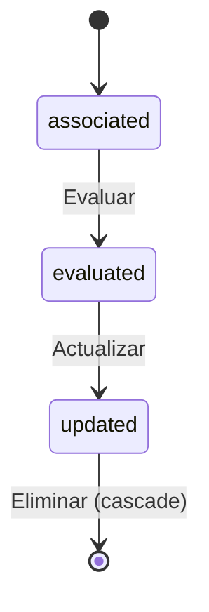

# 📚 LearningSessionCapability

> **IMPORTANTE**: 
> 1. **Verificar siempre** los archivos relacionados:
>    - `database/migrations/2025_06_22_100310_create_learning_session_capabilities_table.php` (estructura de la tabla pivote)
>    - `app/Models/LearningSessionCapability.php` (implementación del modelo)
>    - `resources/js/types/learning-session/learning-session.d.ts` (tipos TypeScript)

## 📌 Ubicación
- **Tipo**: Modelo Pivote
- **Archivo Principal**: `app/Models/LearningSessionCapability.php`
- **Tabla**: `learning_session_capabilities`

## 📦 Archivos Relacionados

### Migraciones
- `database/migrations/2025_06_22_100310_create_learning_session_capabilities_table.php`
  - Estructura de la tabla pivote
  - Claves foráneas con restricciones
  - Índices para optimización de consultas

### Modelos Relacionados
- `app/Models/LearningSession.php` (BelongsTo)
- `app/Models/Capability.php` (BelongsTo)

### Tipos TypeScript
- `resources/js/types/learning-session/learning-session.d.ts`
  - Interfaz `LearningSessionCapability` con campos extendidos
  - Tipos para relaciones y atributos pivote

## 🏗️ Estructura

### Base de Datos (Migraciones)
- **Tabla**: `learning_session_capabilities`
- **Campos Clave**:
  - `id`: bigint - Identificador único
  - `learning_session_id`: bigint - Referencia a la sesión de aprendizaje
  - `capability_id`: bigint - Referencia a la capacidad
  - `score`: decimal(8,2) - Puntuación opcional (2 decimales)
  - `timestamps`: created_at, updated_at

### Relaciones
- **learningSession** (BelongsTo):
  - Modelo: `LearningSession`
  - Clave: `learning_session_id`
  - Comportamiento: cascadeOnDelete

- **capability** (BelongsTo):
  - Modelo: `Capability`
  - Clave: `capability_id`
  - Comportamiento: cascadeOnDelete

## 🎯 Estados del Modelo

### Diagrama de Estados


### Transiciones y Endpoints
> **NOTA**: Los endpoints mostrados son sugerencias basadas en las mejores prácticas de REST.

| Estado Actual | Evento | Nuevo Estado | Endpoint | Método |
|---------------|--------|--------------|----------|--------|
| associated | evaluate | evaluated | `/api/learning-sessions/{id}/capabilities/{capabilityId}/evaluate` (sugerido) | PUT |
| evaluated | update | updated | `/api/learning-sessions/{id}/capabilities/{capabilityId}` (sugerido) | PUT |
| any | delete | - | `/api/learning-sessions/{id}/capabilities/{capabilityId}` (sugerido) | DELETE |

**Leyenda**:
- Sin prefijo: Endpoint existente en el código
- `(sugerido)`: Endpoint recomendado pero no implementado

## 🔄 Relaciones

### learningSession (BelongsTo)
- **Modelo**: `LearningSession`
- **Clave foránea**: `learning_session_id`
- **Descripción**: Sesión de aprendizaje asociada
- **Acceso inverso**: `capabilities()` en el modelo LearningSession

### capability (BelongsTo)
- **Modelo**: `Capability`
- **Clave foránea**: `capability_id`
- **Descripción**: Capacidad asociada a la sesión
- **Acceso inverso**: `learningSessions()` en el modelo Capability

## 🛠️ Uso y Ejemplos

### Asociar capacidades a una sesión
```php
// Obtener la sesión
$session = LearningSession::find(1);

// Obtener capacidades con puntuación específica
$highScoringCapabilities = $session->capabilities()
    ->wherePivot('score', '>', 80)
    ->get();
```

### Consultas comunes
```php
// Obtener todas las sesiones que trabajan una capacidad específica
$sessions = Capability::find(5)
    ->learningSessions()
    ->where('status', 'active')
    ->get();

// Obtener capacidades de una sesión con puntuación
$capabilities = $session->capabilities()
    ->withPivot(['score'])
    ->orderByPivot('score', 'desc')
    ->get();
```

## 🎨 Interfaz TypeScript

```typescript
/**
 * Relación entre LearningSession y Capability
 * con campos adicionales en la tabla pivote
 */
interface LearningSessionCapability {
  id: number;
  learning_session_id: number;
  capability_id: number;
  score?: number;
  created_at: string;
  updated_at: string;
  
  // Relaciones
  learning_session?: LearningSession;
  capability?: Capability;
}

/**
 * Tipo para crear/actualizar relaciones
 */
type LearningSessionCapabilityPivot = {
  score?: number;
};
```

## 🔍 Mejores Prácticas

1. **Validación**:
   - Verificar que la capacidad pertenezca a la misma competencia que la sesión
   - Validar que el score esté dentro del rango permitido (0-100)

2. **Rendimiento**:
   - Usar `sync` para actualizar múltiples relaciones a la vez
   - Cargar relaciones con `with` para evitar el N+1

3. **Seguridad**:
   - Verificar permisos antes de modificar relaciones
   - Usar transacciones para operaciones atómicas

4. **Mantenimiento**:
   - Documentar cambios en las capacidades de las sesiones
   - Mantener consistencia con el plan curricular
 * Representa una capacidad trabajada en una sesión de aprendizaje
## 🛠️ TypeScript Types

### Tipos Básicos

**LearningSessionCapability**: Interfaz que representa la relación entre una sesión de aprendizaje y una capacidad.

**Propiedades principales**:
- `id`: Identificador único (number)
- `learning_session_id`: ID de la sesión de aprendizaje (number)
- `capability_id`: ID de la capacidad asociada (number)
- `score`: Puntuación opcional (number | null)
- `created_at`, `updated_at`: Marcas de tiempo

**Relaciones opcionales**:
- `learning_session`: Datos completos de la sesión
- `capability`: Datos completos de la capacidad

### Tipos Extendidos

**LearningSessionWithCapabilities**: Extensión de LearningSession que incluye las capacidades asociadas.
- `capabilities`: Lista de capacidades
- `learning_session_capabilities`: Relaciones completas con información adicional

**CapabilityWithSessions**: Extensión de Capability que incluye las sesiones relacionadas.
- `learning_sessions`: Lista de sesiones
- `learning_session_capabilities`: Relaciones completas con información adicional

## 🔄 Uso en Laravel

### Relaciones

**En el modelo LearningSession**:
- **Método**: `capabilities()`
- **Tipo**: Relación muchos a muchos con `Capability`
- **Tabla pivote**: `learning_session_capabilities`
- **Claves**: `learning_session_id` y `capability_id`
- **Timestamps**: Incluye marcas de tiempo automáticas

**En el modelo Capability**:
- **Método**: `learningSessions()`
- **Tipo**: Relación muchos a muchos con `LearningSession`
- **Tabla pivote**: `learning_session_capabilities`
- **Claves**: `capability_id` y `learning_session_id`
- **Timestamps**: Incluye marcas de tiempo automáticas

### Operaciones Comunes

1. **Consultar capacidades de una sesión**:
   - Carga ansiosa de capacidades con `with('capabilities')`
   - Ordenamiento por orden de asociación

2. **Gestionar relaciones**:
   - Añadir capacidad: `attach()`
   - Sincronizar capacidades: `sync()`
   - Eliminar capacidad: `detach()`
   - Actualizar metadatos: `updateExistingPivot()`

## 📊 Uso en React

### Componentes Principales

**SessionCard**: Muestra la información de una sesión con sus capacidades asociadas.
- **Props**: `session` (LearningSessionWithCapabilities)
- **Visualización**: Lista de capacidades con puntuación
- **Acciones**: Ver detalles, editar relación

**CapabilityList**: Muestra las capacidades de una sesión.
- **Props**: `capabilities` (Capability[])
- **Visualización**: Lista con iconos y puntuación
- **Filtros**: Por puntuación, tipo de capacidad

### Flujo de Datos

1. **Carga inicial**:
   - Obtener sesión con capacidades usando `LearningSession::with('capabilities')`
   - Mapear datos al tipo TypeScript correspondiente

2. **Actualización**:
   - Enviar cambios al backend mediante mutaciones
   - Actualizar caché local con la respuesta
   - Refrescar la interfaz de usuario

3. **Validación**:
   - Verificar que las capacidades sean compatibles con la sesión
   - Validar puntuaciones dentro de rangos permitidos

### Mejoras de UX

- **Carga perezosa**: Cargar capacidades solo cuando se expanda la sección
- **Edición en línea**: Permitir editar puntuación directamente
- **Filtrado**: Búsqueda y filtrado de capacidades
- **Ordenamiento**: Arrastrar y soltar para cambiar el orden de las capacidades
            <CardDescription className="mt-1">
              {new Date(session.application_date).toLocaleDateString()}
            </CardDescription>
          </div>
          <Badge variant={session.status === 'active' ? 'default' : 'secondary'}>
            {session.status === 'active' ? 'Activa' : 'Inactiva'}
          </Badge>
        </div>
      </CardHeader>
      
      <CardContent>
        <div className="space-y-4">
          <div>
            <h4 className="text-sm font-medium mb-2">Propósito de Aprendizaje</h4>
            <p className="text-sm text-muted-foreground">
              {session.purpose_learning}
            </p>
          </div>
          
          {session.capabilities && session.capabilities.length > 0 && (
            <div>
              <h4 className="text-sm font-medium mb-2">Capacidades</h4>
              <div className="flex flex-wrap gap-2">
                {session.capabilities.map((capability) => (
                  <Badge key={capability.id} variant="outline">
                    {capability.name}
                  </Badge>
                ))}
              </div>
            </div>
          )}
        </div>
      </CardContent>
    </Card>
  );
}
```

## 🔍 Mejores Prácticas

1. **Carga Eficiente**:
   - Usar `with('capabilities')` para evitar el problema N+1
   - Cargar solo las columnas necesarias con `select()`

2. **Validación**:
   - Validar que las capacidades existan antes de asociarlas
   - Usar transacciones para operaciones atómicas

3. **Rendimiento**:
   - Crear índices para las columnas de búsqueda frecuente
   - Considerar la paginación para sesiones con muchas capacidades

4. **Seguridad**:
   - Verificar permisos antes de modificar relaciones
   - Usar políticas para autorizar accesos

## 📚 Recursos Relacionados
- [Documentación de Eloquent: Relaciones Muchos a Muchos](https://laravel.com/docs/eloquent-relationships#many-to-many)
- [Documentación de Laravel: Migraciones](https://laravel.com/docs/migrations)
- [Guía de Patrones de Diseño para Relaciones](https://laravel-news.com/eloquent-relationships-the-complete-guide)
