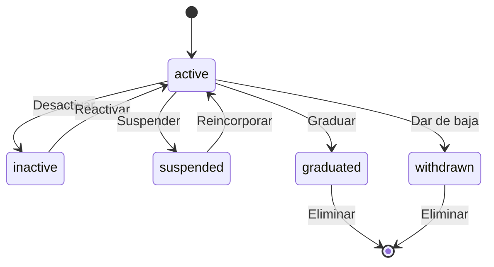

# 🎓 Student

> **IMPORTANTE**: 
> 1. **Verificar siempre** los archivos relacionados:
>    - `database/migrations/2025_06_22_100030_create_students_table.php` (estructura de la tabla)
>    - `app/Models/Student.php` (implementación del modelo)
>    - `resources/js/types/user/student/types.d.ts` (tipos TypeScript)

## 📌 Ubicación
- **Tipo**: Modelo (extiende User)
- **Archivo Principal**: `app/Models/Student.php`
- **Tabla**: `students`

## 📦 Archivos Relacionados

### Migraciones
- `database/migrations/2025_06_22_100030_create_students_table.php`
  - Estructura de la tabla de estudiantes
  - Claves foráneas a users, levels y ranges
  - Índices para optimización

### Modelos Relacionados
- `app/Models/User.php` (extiende)
- `app/Models/Level.php` (BelongsTo)
- `app/Models/Range.php` (BelongsTo)
- `app/Models/Enrollment.php` (HasMany)
- `app/Models/ApplicationFormResponse.php` (HasMany)

### Tipos TypeScript
- `resources/js/types/user/student/types.d.ts`
  - Interfaz `Student` extendiendo `User`
  - Tipos para estados y relaciones
- `resources/js/types/application-form/form/response/application-form-response.d.ts`
  - Tipos para respuestas a formularios

## 🏗️ Estructura

### Base de Datos (Migraciones)
- **Tabla**: `students`
- **Campos Clave**:
  - `user_id`: bigint - Clave primaria y foránea a users
  - `level_id`: bigint - Nivel actual
  - `range_id`: bigint - Rango actual
  - `entry_date`: date - Fecha de ingreso
  - `status`: enum - Estado actual (active, inactive, etc.)
  - `experience_achieved`: decimal(10,2) - Experiencia acumulada
  - `points_store_achieved`: decimal(10,2) - Puntos totales ganados
  - `points_store`: decimal(10,2) - Puntos disponibles
  - `graduation_date`: date - Fecha de graduación
  - `timestamps`: created_at, updated_at, deleted_at

### Relaciones
- **user** (BelongsTo):
  - Modelo: `User`
  - Clave: `user_id`
  - Comportamiento: cascadeOnDelete

- **level** (BelongsTo):
  - Modelo: `Level`
  - Clave: `level_id`
  - Comportamiento: set null on delete

- **range** (BelongsTo):
  - Modelo: `Range`
  - Clave: `range_id`
  - Comportamiento: set null on delete

- **enrollments** (HasMany):
  - Modelo: `Enrollment`
  - Clave: `student_id`
  - Comportamiento: cascadeOnDelete

- **applicationFormResponses** (HasMany):
  - Modelo: `ApplicationFormResponse`
  - Clave: `student_id`
  - Comportamiento: cascadeOnDelete

## 🎯 Estados del Modelo

### Diagrama de Estados


### Transiciones y Endpoints
> **NOTA**: Los endpoints mostrados son sugerencias basadas en las mejores prácticas de REST.

| Estado Actual | Evento | Nuevo Estado | Endpoint | Método |
|---------------|--------|--------------|----------|--------|
| active | deactivate | inactive | `/api/students/{id}/deactivate` (sugerido) | PUT |
| inactive | activate | active | `/api/students/{id}/activate` (sugerido) | PUT |
| active | suspend | suspended | `/api/students/{id}/suspend` (sugerido) | PUT |
| suspended | unsuspend | active | `/api/students/{id}/unsuspend` (sugerido) | PUT |
| active | graduate | graduated | `/api/students/{id}/graduate` (sugerido) | PUT |
| active | withdraw | withdrawn | `/api/students/{id}/withdraw` (sugerido) | PUT |
| any | delete | - | `/api/students/{id}` (sugerido) | DELETE |

**Leyenda**:
- Sin prefijo: Endpoint existente en el código
- `(sugerido)`: Endpoint recomendado pero no implementado

## 🤝 Relaciones

### user (BelongsTo)
- **Método**: `user()`
- **Modelo**: `User`
- **Clave foránea**: `user_id`
- **Tipo**: `BelongsTo`
- **Descripción**: Relación con el modelo User al que pertenece este estudiante

## 🧩 TypeScript Types

### Interfaz Principal
```typescript
/**
 * Representa un estudiante en el sistema
 * @see database/migrations/2025_06_22_100030_create_students_table.php
 * @see app/Models/Student.php
 */
interface Student extends User {
  // Clave primaria (user_id)
  user_id: number;

  // Claves foráneas
  level_id: number | null;
  range_id: number | null;

  // Atributos
  entry_date: string;
  status: StudentStatus;
  experience_achieved: number;
  points_store_achieved: number;
  points_store: number;
  graduation_date: string | null;
  created_at: string;
  updated_at: string;
  deleted_at: string | null;

  // Relaciones
  level?: Level | null;
  range?: Range | null;
  enrollments?: Enrollment[];
  classrooms?: Classroom[];
  achievements?: StudentAchievement[];
  availableAchievements?: Achievement[];
  avatars?: StudentAvatar[];
  backgrounds?: StudentBackground[];
  levelHistory?: StudentLevelHistory[];
  applicationForms?: ApplicationForm[];
  applicationFormResponses?: ApplicationFormResponse[];
  storeRewards?: StudentStoreReward[];
}
```

### Tipos Relacionados

#### StudentStatus
```typescript
/**
 * Estados posibles para un estudiante
 */
type StudentStatus = 'active' | 'inactive' | 'suspended' | 'graduated' | 'withdrawn';
```

#### CreateStudent
```typescript
/**
 * Tipo para crear un nuevo estudiante
 */
type CreateStudent = {
  user_id: number;
  level_id: number;
  range_id: number;
  entry_date: string;
  status?: StudentStatus;
  experience_achieved?: number;
  points_store_achieved?: number;
  points_store?: number;
  graduation_date?: string | null;
};
```

#### UpdateStudent
```typescript
/**
 * Tipo para actualizar un estudiante existente
 */
type UpdateStudent = Partial<Omit<CreateStudent, 'user_id'>>;
```

## 🛠️ Métodos

### activeAvatar()
- **Retorna**: `Avatar|null`
- **Descripción**: Obtiene el avatar activo del estudiante

### activeBackground()
- **Retorna**: `Background|null`
- **Descripción**: Obtiene el fondo activo del estudiante

### level (BelongsTo)
- **Método**: `level()`
- **Modelo**: `Level`
- **Clave foránea**: `level_id`
- **Tipo**: `BelongsTo`
- **Descripción**: Nivel actual del estudiante en el sistema

### range (BelongsTo)
- **Método**: `range()`
- **Modelo**: `Range`
- **Clave foránea**: `range_id`
- **Tipo**: `BelongsTo`
- **Descripción**: Rango actual del estudiante

### enrollments (HasMany)
- **Método**: `enrollments()`
- **Modelo**: `Enrollment`
- **Clave foránea**: `student_id`
- **Tipo**: `HasMany`
- **Descripción**: Matrículas del estudiante en diferentes períodos académicos

### classrooms (BelongsToMany)
- **Método**: `classrooms()`
- **Modelo**: `Classroom`
- **Tabla intermedia**: `enrollments`
- **Claves**: 
  - `student_id` (local)
  - `classroom_id` (foránea)
- **Tipo**: `BelongsToMany`
- **Descripción**: Aulas a las que está asignado el estudiante

### applicationForms (HasMany)
- **Método**: `applicationForms()`
- **Modelo**: `ApplicationForm`
- **Clave foránea**: `student_id`
- **Tipo**: `HasMany`
- **Descripción**: Formularios de aplicación del estudiante

### applicationFormResponses (HasMany)
- **Método**: `applicationFormResponses()`
- **Modelo**: `ApplicationFormResponse`
- **Clave foránea**: `student_id`
- **Tipo**: `HasMany`
- **Descripción**: Respuestas a formularios de aplicación

### storeRewards (BelongsToMany)
- **Método**: `storeRewards()`
- **Modelo**: `StoreReward`
- **Tabla intermedia**: `student_store_rewards`
- **Campos adicionales**: 
  - `status`
  - `redeemed_at`
- **Tipo**: `BelongsToMany`
- **Descripción**: Recompensas canjeadas por el estudiante

### avatars (BelongsToMany)
- **Método**: `avatars()`
- **Modelo**: `Avatar`
- **Tabla intermedia**: `student_avatars`
- **Campos adicionales**: 
  - `is_active`
- **Tipo**: `BelongsToMany`
- **Descripción**: Avatares desbloqueados por el estudiante

### backgrounds (BelongsToMany)
- **Método**: `backgrounds()`
- **Modelo**: `Background`
- **Tabla intermedia**: `student_backgrounds`
- **Campos adicionales**: 
  - `is_active`
- **Tipo**: `BelongsToMany`
- **Descripción**: Fondos de perfil desbloqueados

### achievements (BelongsToMany)
- **Método**: `achievements()`
- **Modelo**: `Achievement`
- **Tabla intermedia**: `student_achievements`
- **Tipo**: `BelongsToMany`
- **Descripción**: Logros desbloqueados

## 🛠️ Métodos

### activeAvatar()
- **Retorna**: `Avatar|null`
- **Descripción**: Obtiene el avatar activo del estudiante

### activeBackground()
- **Retorna**: `Background|null`
- **Descripción**: Obtiene el fondo activo del estudiante

### levelHistory()
- **Retorna**: `HasMany<StudentLevelHistory>`
- **Descripción**: Obtiene el historial de niveles del estudiante

### scopeStatus(Builder $query, string $status)
- **Parámetros**: 
  - `$status`: Estado a filtrar
- **Retorna**: `Builder`
- **Descripción**: Filtra estudiantes por estado

### scopeActive(Builder $query)
- **Retorna**: `Builder`
- **Descripción**: Filtra estudiantes activos

### scopeInactive(Builder $query)
- **Retorna**: `Builder`
- **Descripción**: Filtra estudiantes inactivos

### scopeGraduated(Builder $query)
- **Retorna**: `Builder`
- **Descripción**: Filtra estudiantes graduados

## 🛠️ TypeScript Types

### Interfaz `Student`
```typescript
/**
 * Representa un estudiante en el sistema
 * @see database/migrations/2025_06_22_100030_create_students_table.php
 * @see app/Models/Student.php
 */
interface Student extends User {
  // Clave primaria (user_id)
  user_id: number;

  // Claves foráneas
  level_id: number | null;
  range_id: number | null;

  // Atributos
  entry_date: string;
  status: StudentStatus;  // 'active' | 'inactive' | 'suspended' | 'graduated' | 'withdrawn'
  experience_achieved: number;
  points_store_achieved: number;
  points_store: number;
  graduation_date: string | null;
  created_at: string;
  updated_at: string;
  deleted_at: string | null;

  // Relaciones
  level?: Level | null;
  range?: Range | null;
  enrollments?: Enrollment[];
  classrooms?: Classroom[];
  achievements?: StudentAchievement[];
  availableAchievements?: Achievement[];
  avatars?: StudentAvatar[];
  backgrounds?: StudentBackground[];
  levelHistory?: StudentLevelHistory[];
  applicationForms?: ApplicationForm[];
  applicationFormResponses?: ApplicationFormResponse[];
  storeRewards?: StudentStoreReward[];
}

/**
 * Tipo para crear un nuevo estudiante
 * @see database/migrations/2025_06_22_100030_create_students_table.php
 */
type CreateStudent = {
  user_id: number;
  level_id: number;
  range_id: number;
  entry_date: string;
  status?: StudentStatus;
  experience_achieved?: number;
  points_store_achieved?: number;
  points_store?: number;
  graduation_date?: string | null;
};

/**
 * Tipo para actualizar un estudiante existente
 */
type UpdateStudent = Partial<Omit<CreateStudent, 'user_id'>>;

/**
 * Estado posible de un estudiante
 */
type StudentStatus = 'active' | 'inactive' | 'suspended' | 'graduated' | 'withdrawn';

/**
 * Respuesta de un estudiante a un formulario
 */
interface ApplicationFormResponse {
  id: number;
  application_form_id: number;
  student_id: number;
  status: 'pending' | 'in_progress' | 'submitted' | 'graded';
  score: number | null;
  response_questions: ApplicationFormResponseQuestion[];
  created_at: string;
  updated_at: string;
}

/**
 * Pregunta respondida en un formulario
 */
interface ApplicationFormResponseQuestion {
  id: number;
  response_id: number;
  question_id: number;
  explanation: string | null;
  score: number | null;
  selected_options: ApplicationFormResponseQuestionOption[];
  question: Question;
}

/**
 * Opción seleccionada en una pregunta
 */
interface ApplicationFormResponseQuestionOption {
  id: number;
  response_question_id: number;
  question_option_id: number;
  value: string;
  is_correct: boolean;
  created_at: string;
  updated_at: string;
}

/**
 * Pregunta de un formulario
 */
interface Question {
  id: number;
  name: string;
  description: string;
  question_type_id: number;
  question_type: QuestionType;
  options: QuestionOption[];
  difficulty: 'easy' | 'medium' | 'hard';
  explanation_required: boolean;
}

/**
 * Opción de una pregunta
 */
interface QuestionOption {
  id: number;
  question_id: number;
  value: string;
  is_correct: boolean;
  order: number;
  pair_key?: string;
  pair_side?: 'left' | 'right';
  created_at: string;
  updated_at: string;
}

/**
 * Tipo de pregunta
 */
interface QuestionType {
  id: number;
  name: string;
  description: string;
  created_at: string;
  updated_at: string;
}

}
```

## 🚀 Uso en React

### Perfil del Estudiante
```typescript
import { usePage } from '@inertiajs/react';
import { PageProps } from '@/types';
import StudentLayout from '@/Layouts/StudentLayout';

export default function Profile() {
  const { student } = usePage<PageProps>().props.auth;
  
  return (
    <StudentLayout>
      <div className="space-y-4">
        <div className="bg-white p-6 rounded-lg shadow">
          <div className="flex items-center space-x-6">
            {student.active_avatar && (
              
            )}
            <div>
              <h1 className="text-2xl font-bold">
                {student.user.name}
              </h1>
              <div className="text-gray-600">
                Nivel {student.level?.name || 'Sin asignar'}
              </div>
              <div className="mt-2">
                <div className="flex items-center">
                  <span className="text-yellow-500 mr-2">★</span>
                  <span>{student.points_store} puntos</span>
                </div>
                <div className="w-full bg-gray-200 rounded-full h-2.5 mt-1">
                  <div 
                    className="bg-blue-600 h-2.5 rounded-full" 
                    style={{ width: `${calculateExperiencePercentage(student)}%` }}
                  ></div>
                </div>
                <div className="text-sm text-gray-500 mt-1">
                  {student.experience_achieved} EXP
                </div>
              </div>
            </div>
          </div>
        </div>
        
        {/* Sección de logros */}
        <div className="bg-white p-6 rounded-lg shadow">
          <h2 className="text-xl font-semibold mb-4">Logros</h2>
          <div className="grid grid-cols-2 md:grid-cols-4 gap-4">
            {student.achievements?.map((achievement) => (
              <div key={achievement.id} className="text-center">
                <div className="w-16 h-16 mx-auto bg-gray-100 rounded-full flex items-center justify-center mb-2">
                  <span className="text-2xl">{achievement.icon}</span>
                </div>
                <div className="text-sm font-medium">{achievement.name}</div>
              </div>
            ))}
            {(!student.achievements || student.achievements.length === 0) && (
              <p className="text-gray-500">Aún no has desbloqueado logros</p>
            )}
          </div>
        </div>
      </div>
    </StudentLayout>
  );
}
```

### Actualización de Perfil
```typescript
import { useForm } from '@inertiajs/react';
import StudentLayout from '@/Layouts/StudentLayout';

export default function EditProfile() {
  const { student } = usePage().props.auth;
  
  const { data, setData, put, processing, errors } = useForm({
    bio: student.bio || '',
    avatar_id: student.active_avatar?.id || null,
    background_id: student.active_background?.id || null,
  });
  
  const submit = (e: React.FormEvent) => {
    e.preventDefault();
    put(route('student.profile.update'));
  };
  
  return (
    <StudentLayout>
      <form onSubmit={submit} className="space-y-6">
        <div className="bg-white p-6 rounded-lg shadow">
          <h2 className="text-xl font-semibold mb-4">Personalización</h2>
          
          <div className="mb-4">
            <label className="block text-sm font-medium text-gray-700 mb-1">
              Avatar
            </label>
            <div className="grid grid-cols-4 gap-4">
              {student.avatars?.map((avatar) => (
                <label 
                  key={avatar.id}
                  className={`p-2 border-2 rounded-lg cursor-pointer transition-colors ${
                    data.avatar_id === avatar.id 
                      ? 'border-blue-500 bg-blue-50' 
                      : 'border-gray-200 hover:border-gray-300'
                  }`}
                >
                  <input
                    type="radio"
                    name="avatar_id"
                    value={avatar.id}
                    checked={data.avatar_id === avatar.id}
                    onChange={() => setData('avatar_id', avatar.id)}
                    className="sr-only"
                  />
                  
                  <div className="text-center mt-2 text-sm">
                    {avatar.name}
                  </div>
                </label>
              ))}
            </div>
            {errors.avatar_id && (
              <p className="mt-1 text-sm text-red-600">{errors.avatar_id}</p>
            )}
          </div>
          
          <div className="flex justify-end">
            <button
              type="submit"
              disabled={processing}
              className="px-4 py-2 bg-blue-600 text-white rounded-md hover:bg-blue-700 disabled:opacity-50"
            >
              {processing ? 'Guardando...' : 'Guardar cambios'}
            </button>
          </div>
        </div>
      </form>
    </StudentLayout>
  );
}
```

## 🔒 Seguridad

### Reglas de Acceso
- Solo usuarios con rol 'admin' pueden crear o modificar registros de estudiantes
- Los estudiantes solo pueden ver y modificar su propia información
- Los profesores pueden ver información básica de sus estudiantes
- Se validan los permisos mediante políticas de Laravel

### Validaciones
- El `user_id` debe ser único en la tabla students
- La fecha de ingreso es obligatoria y debe ser una fecha válida
- Los campos de experiencia y puntos deben ser números positivos
- El estado debe ser uno de los valores permitidos

### Auditoría
- Se registran todos los cambios importantes en el sistema de auditoría
- Se mantiene un historial de cambios de nivel y rango
- Se pueden generar reportes de progreso académico

### Eliminación Segura
- Se utiliza soft delete para mantener la integridad referencial
- Los registros eliminados se pueden restaurar si es necesario
- Se mantiene la relación con el usuario incluso después de la eliminación

## 📝 Buenas Prácticas
1. **Validación**: Usar Form Requests para validar la creación/actualización
2. **Autorización**: Implementar políticas para controlar el acceso
3. **Rendimiento**: Cargar relaciones con `with()` cuando sea necesario
4. **Transacciones**: Usar transacciones para operaciones atómicas
5. **Eventos**: Escuchar eventos para lógica de negocio compleja
