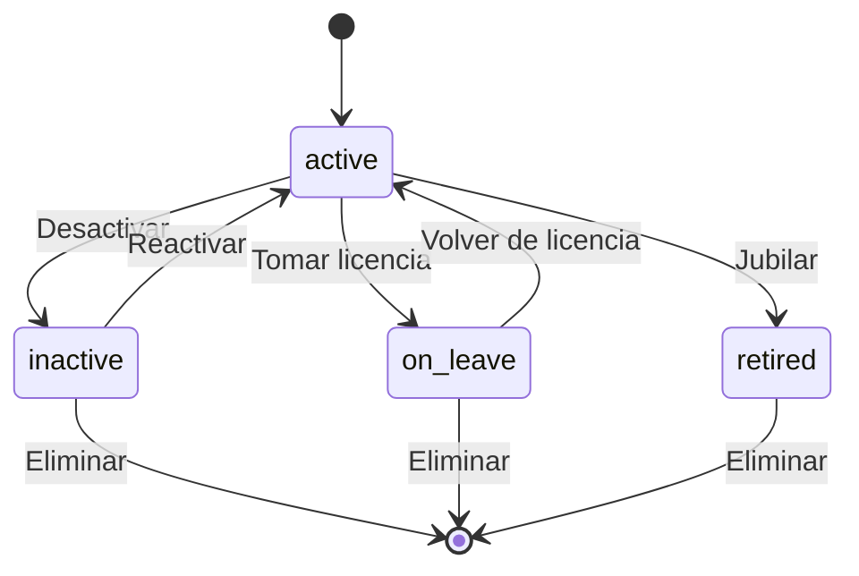

# 🎓 Teacher

> **IMPORTANTE**: 
> 1. **Verificar siempre** los archivos relacionados:
>    - `database/migrations/2025_06_22_100040_create_teachers_table.php` (estructura de la tabla)
>    - `app/Models/Teacher.php` (implementación del modelo)
>    - `resources/js/types/user/teacher.d.ts` (tipos TypeScript)

## 📌 Ubicación
- **Tipo**: Modelo (extiende User)
- **Archivo Principal**: `app/Models/Teacher.php`
- **Tabla**: `teachers`

## 📦 Archivos Relacionados

### Migraciones
- `database/migrations/2025_06_22_100040_create_teachers_table.php`
  - Estructura de la tabla de profesores
  - Relación con la tabla users
  - Índices para optimización

### Modelos Relacionados
- `app/Models/User.php` (extiende)
- `app/Models/Classroom.php` (BelongsToMany)
- `app/Models/LearningSession.php` (HasMany)
- `app/Models/ApplicationForm.php` (HasMany)

### Tipos TypeScript
- `resources/js/types/user/teacher.d.ts`
  - Interfaz `Teacher` extendiendo `User`
  - Tipos para estados y relaciones
- `resources/js/types/application-form/application-form.d.ts`
  - Tipos para formularios creados por el profesor

## 🏗️ Estructura

### Base de Datos (Migraciones)
- **Tabla**: `teachers`
- **Campos Clave**:
  - `user_id`: int - Clave primaria y foránea a users
  - `status`: enum - Estado actual (active, inactive, on_leave, retired)
  - `timestamps`: created_at, updated_at, deleted_at

### Relaciones
- **user** (BelongsTo):
  - Modelo: `User`
  - Clave: `user_id`
  - Comportamiento: cascadeOnDelete

- **classrooms** (BelongsToMany):
  - Modelo: `Classroom`
  - Tabla intermedia: `classroom_teacher`
  - Claves: `teacher_id`, `classroom_id`

- **learningSessions** (HasMany):
  - Modelo: `LearningSession`
  - Clave: `teacher_id`
  - Comportamiento: cascadeOnDelete

- **applicationForms** (HasMany):
  - Modelo: `ApplicationForm`
  - Clave: `teacher_id`
  - Comportamiento: cascadeOnDelete

## 🎯 Estados del Modelo

### Diagrama de Estados


### Transiciones y Endpoints
> **NOTA**: Los endpoints mostrados son sugerencias basadas en las mejores prácticas de REST.

| Estado Actual | Evento | Nuevo Estado | Endpoint | Método |
|---------------|--------|--------------|----------|--------|
| active | deactivate | inactive | `/api/teachers/{id}/deactivate` (sugerido) | PUT |
| inactive | activate | active | `/api/teachers/{id}/activate` (sugerido) | PUT |
| active | leave | on_leave | `/api/teachers/{id}/leave` (sugerido) | PUT |
| on_leave | return | active | `/api/teachers/{id}/return` (sugerido) | PUT |
| active | retire | retired | `/api/teachers/{id}/retire` (sugerido) | PUT |
| any | delete | - | `/api/teachers/{id}` (sugerido) | DELETE |

**Leyenda**:
- Sin prefijo: Endpoint existente en el código
- `(sugerido)`: Endpoint recomendado pero no implementado

### 🎯 Scopes
- **active()**: Filtra profesores activos
- **inactive()**: Filtra profesores inactivos
- **onLeave()**: Filtra profesores en licencia
- **retired()**: Filtra profesores retirados

## 🤝 Relaciones

### user (BelongsTo)
- **Método**: `user()`
- **Retorna**: `BelongsTo<User>`
- **Descripción**: Relación con el modelo User al que pertenece este profesor

### classrooms (BelongsToMany)
- **Método**: `classrooms()`
- **Retorna**: `BelongsToMany<Classroom>`
- **Tabla intermedia**: `teacher_classroom_curricular_area_cycles`
- **Datos adicionales**: `academic_year`, `curricular_area_cycle_id`
- **Descripción**: Aulas asignadas al profesor a través de la tabla de relación con áreas curriculares y ciclos

### curricularAreas (BelongsToMany)
- **Método**: `curricularAreas()`
- **Retorna**: `BelongsToMany<CurricularArea>`
- **Tabla intermedia**: `teacher_classroom_curricular_area_cycles`
- **Datos adicionales**: `classroom_id`, `academic_year`
- **Usa**: `TeacherClassroomCurricularAreaCycle` como modelo personalizado
- **Descripción**: Áreas curriculares que puede enseñar el profesor

### curricularAreaCycles (BelongsToMany)
- **Método**: `curricularAreaCycles()`
- **Retorna**: `BelongsToMany<CurricularAreaCycle>`
- **Tabla intermedia**: `teacher_classroom_curricular_area_cycles`
- **Datos adicionales**: `classroom_id`, `academic_year`
- **Descripción**: Relación con ciclos de áreas curriculares asignados al profesor

### teacherAssignments (HasMany)
- **Método**: `teacherAssignments()`
- **Retorna**: `HasMany<TeacherClassroomCurricularAreaCycle>`
- **Clave foránea**: `teacher_id`
- **Clave local**: `user_id`
- **Descripción**: Asignaciones completas del profesor (aula + área curricular + ciclo)

### applicationForms (HasMany)
- **Método**: `applicationForms()`
- **Retorna**: `HasMany<ApplicationForm>`
- **Clave foránea**: `teacher_id`
- **Clave local**: `user_id`
- **Descripción**: Formularios de aplicación creados por este profesor

### learningSessions (HasMany)
- **Método**: `learningSessions()`
- **Retorna**: `HasMany<LearningSession>`
- **Clave foránea**: `teacher_id`
- **Clave local**: `user_id`
- **Descripción**: Sesiones de aprendizaje creadas por este profesor

## 🛠️ Métodos de Consulta

### active()
- **Tipo**: Scope
- **Parámetros**: `Builder $query`
- **Retorna**: `Builder`
- **Descripción**: Filtra los profesores activos (status = 'active')

### inactive()
- **Tipo**: Scope
- **Parámetros**: `Builder $query`
- **Retorna**: `Builder`
- **Descripción**: Filtra los profesores inactivos (status = 'inactive')

### onLeave()
- **Tipo**: Scope
- **Parámetros**: `Builder $query`
- **Retorna**: `Builder`
- **Descripción**: Filtra los profesores en licencia (status = 'on leave')

### retired()
- **Tipo**: Scope
- **Parámetros**: `Builder $query`
- **Retorna**: `Builder`
- **Descripción**: Filtra los profesores retirados (status = 'retired')

### isActive()
- **Retorna**: `bool`
- **Descripción**: Verifica si el profesor está activo

### isInactive()
- **Retorna**: `bool`
- **Descripción**: Verifica si el profesor está inactivo

### isOnLeave()
- **Retorna**: `bool`
- **Descripción**: Verifica si el profesor está en licencia

### isRetired()
- **Retorna**: `bool`
- **Descripción**: Verifica si el profesor está retirado

## 📦 Tipos TypeScript

### TeacherStatus Type
```typescript
/**
 * Estados posibles de un profesor
 */
type TeacherStatus = 'active' | 'inactive' | 'on leave' | 'retired';

/**
 * Representa un profesor en el sistema
 */
export interface Teacher {
  /** Referencia al usuario (clave primaria) */
  user_id: number;

  /** Estado actual del profesor */
  status: TeacherStatus;

  /** Fecha y hora de creación */
  created_at: string;

  /** Fecha y hora de última actualización */
  updated_at: string;

  /** Fecha de eliminación lógica (soft delete) */
  deleted_at: string | null;

  // Relaciones
  /** Usuario asociado a este profesor */
  user?: User;
  
  /** Aulas asignadas a este profesor */
  classrooms?: Classroom[];
  
  /** Áreas curriculares que puede enseñar */
  curricularAreas?: CurricularArea[];
  
  /** Ciclos de áreas curriculares asignados */
  curricularAreaCycles?: CurricularAreaCycle[];
  
  /** Asignaciones completas (aula + área + ciclo) */
  teacherAssignments?: TeacherClassroomCurricularAreaCycle[];
  
  /** Formularios de aplicación creados */
  applicationForms?: ApplicationForm[];
  
  /** Sesiones de aprendizaje creadas */
  learningSessions?: LearningSession[];
}

## 🛠️ TypeScript Types

### Tipos Básicos

**TeacherStatus**: Enumeración que representa los posibles estados de un profesor: 'active', 'inactive', 'on leave', 'retired'.

### Estructura de Datos del Profesor

**Teacher**: Interfaz principal que representa a un profesor en el frontend.
- **Propiedades principales**:
  - `user_id`: Identificador único del usuario asociado (number)
  - `status`: Estado actual del profesor (TeacherStatus)
  - `created_at`, `updated_at`, `deleted_at`: Marcas de tiempo

**Relaciones**:
- `user`: Datos del usuario asociado
- `classrooms`: Aulas asignadas al profesor
- `curricularAreas`: Áreas curriculares que puede enseñar
- `curricularAreaCycles`: Ciclos de áreas curriculares asignados
- `teacherAssignments`: Asignaciones completas (aula + área + ciclo)
- `applicationForms`: Formularios creados por el profesor
- `learningSessions`: Sesiones de aprendizaje creadas
- `questions`: Preguntas creadas
- `evaluations`: Evaluaciones realizadas
- `evaluationResults`: Resultados de evaluaciones

### Tipos para Operaciones CRUD

**CreateTeacher**: Estructura para crear un nuevo profesor. Incluye campos obligatorios como user_id y status.

**UpdateTeacher**: Tipo parcial para actualizar un profesor existente, permitiendo modificar cualquier campo excepto el user_id.

### Tipos Relacionados

**TeacherClassroomCurricularAreaCycle**: Tabla intermedia que relaciona profesores con aulas, áreas curriculares y ciclos. Incluye metadatos como el año académico y relaciones con las entidades asociadas.

**TeacherAssignment**: Representa una asignación completa de profesor, incluyendo aula, área curricular, ciclo y año académico.

## Notas Adicionales
- Utiliza eliminación lógica (SoftDeletes) para mantener el historial
- Relación uno a uno con el modelo User a través del campo user_id
- Gestiona permisos y accesos específicos para profesores
- Mantiene la integridad referencial con las aulas y áreas curriculares
