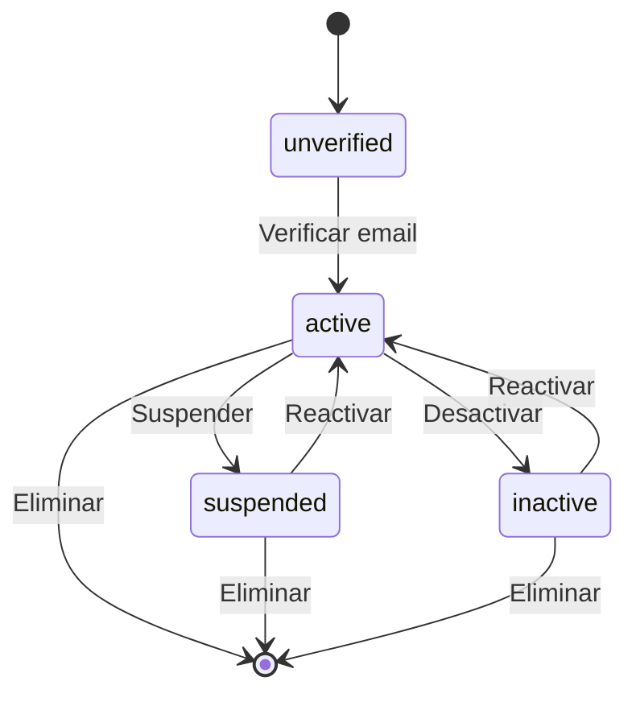

# 👤 User

> **IMPORTANTE**: 
> 1. **Verificar siempre** los archivos relacionados:
>    - `database/migrations/0001_01_01_000000_create_users_table.php` (estructura de la tabla)
>    - `app/Models/User.php` (implementación del modelo)
>    - `resources/js/types/user/user.d.ts` (tipos TypeScript)

## 📌 Ubicación
- **Tipo**: Modelo de Autenticación
- **Archivo Principal**: `app/Models/User.php`
- **Tabla**: `users`

## 📦 Archivos Relacionados

### Migraciones
- `database/migrations/0001_01_01_000000_create_users_table.php`
  - Estructura base de usuarios
  - Índices para email y autenticación
  - Soporte para soft delete

### Modelos Relacionados
- `app/Models/Profile.php` (HasOne)
- `app/Models/Student.php` (HasOne, opcional)
- `app/Models/Teacher.php` (HasOne, opcional)
- `Spatie\Permission\Traits\HasRoles` (Trait para roles)

### Tipos TypeScript
- `resources/js/types/user/user.d.ts`
  - Interfaz `User` con propiedades básicas
  - Tipos para autenticación y roles
- `resources/js/types/auth/profile.d.ts`
  - Tipos para perfiles de usuario
- `resources/js/types/user/student/types.d.ts`
  - Tipos específicos para estudiantes

## 🏗️ Estructura

### Base de Datos (Migraciones)
- **Tabla**: `users`
- **Campos Clave**:
  - `id`: bigint - Identificador único
  - `email`: string - Correo electrónico (único)
  - `email_verified_at`: timestamp - Fecha de verificación
  - `password`: string - Hash de contraseña
  - `remember_token`: string - Token de sesión persistente
  - `timestamps`: created_at, updated_at, deleted_at

### Relaciones
- **profile** (HasOne):
  - Modelo: `Profile`
  - Clave: `user_id`
  - Comportamiento: cascadeOnDelete

- **student** (HasOne):
  - Modelo: `Student`
  - Clave: `user_id`
  - Comportamiento: cascadeOnDelete

- **teacher** (HasOne):
  - Modelo: `Teacher`
  - Clave: `user_id`
  - Comportamiento: cascadeOnDelete

- **roles** (BelongsToMany):
  - Modelo: `Spatie\Permission\Models\Role`
  - Tabla intermedia: `model_has_roles`
  - Claves: `model_id`, `role_id`

## 🎯 Estados del Modelo

### Diagrama de Estados


### Transiciones y Endpoints
> **NOTA**: Los endpoints mostrados son sugerencias basadas en las mejores prácticas de REST.

| Estado Actual | Evento | Nuevo Estado | Endpoint | Método |
|---------------|--------|--------------|----------|--------|
| unverified | verify | active | `/api/email/verify/{id}` | GET |
| active | suspend | suspended | `/api/users/{id}/suspend` (sugerido) | PUT |
| suspended | unsuspend | active | `/api/users/{id}/unsuspend` (sugerido) | PUT |
| active | deactivate | inactive | `/api/users/{id}/deactivate` (sugerido) | PUT |
| inactive | activate | active | `/api/users/{id}/activate` (sugerido) | PUT |
| any | delete | - | `/api/users/{id}` | DELETE |

**Leyenda**:
- Sin prefijo: Endpoint existente en el código
- `(sugerido)`: Endpoint recomendado pero no implementado

### 📊 Tabla: `profiles`

#### 🔑 Claves
- **Primaria**: `user_id` (bigint, foránea a users.id)
- **Índices**:
  - `idx_profile_full_name` (first_name, last_name, second_last_name)

#### 📋 Columnas
| Columna | Tipo | Nulo | Default | Descripción |
|---------|------|------|---------|-------------|
| user_id | bigint | No | - | Referencia al usuario |
| first_name | string(100) | No | - | Nombre(s) del usuario |
| last_name | string(100) | No | - | Apellido paterno |
| second_last_name | string(100) | Sí | NULL | Apellido materno (opcional) |
| birth_date | date | Sí | NULL | Fecha de nacimiento |
| phone | string(20) | Sí | NULL | Teléfono de contacto |
| created_at | timestamp | No | CURRENT_TIMESTAMP | Fecha de creación |
| updated_at | timestamp | No | CURRENT_TIMESTAMP | Fecha de actualización |
| deleted_at | timestamp | Sí | NULL | Fecha de eliminación (soft delete) |

#### 🔄 Tablas Relacionadas
1. `password_reset_tokens`
   - **Clave primaria**: `email` (string)
   - **Propósito**: Almacena tokens para restablecimiento de contraseña

2. `sessions`
   - **Clave primaria**: `id` (string)
   - **Propósito**: Almacena las sesiones de usuario activas

## 🤝 Relaciones

### profile (HasOne)
- **Modelo**: `Profile`
- **Clave foránea**: `user_id`
- **Descripción**: Perfil extendido del usuario

### student (HasOne)
- **Modelo**: `Student`
- **Clave foránea**: `user_id`
- **Descripción**: Datos específicos si el usuario es estudiante

### teacher (HasOne)
- **Modelo**: `Teacher`
- **Clave foránea**: `user_id`
- **Descripción**: Datos específicos si el usuario es profesor

## TypeScript Types

## TypeScript Types

### Tipos Básicos

```typescript
type UserRole = 'admin' | 'teacher' | 'student' | 'guest';

type Profile = {
  user_id: number;
  first_name: string;
  last_name: string;
  second_last_name?: string | null;
  birth_date?: string | null;
  phone?: string | null;
  created_at: string;
  updated_at: string;
  deleted_at?: string | null;
};
/**
 * Representa un usuario en el sistema
 * @see app/Models/User.php
 * @see database/migrations/0001_01_01_000000_create_users_table.php
 */
## 📋 Tipos de Usuario

### Roles de Usuario
- **admin**: Administrador del sistema con acceso completo
- **teacher**: Profesor con acceso a funciones docentes
- **student**: Estudiante con acceso a funcionalidades de aprendizaje
- **guest**: Usuario invitado con acceso limitado

## 🔍 Estructura del Usuario

### Propiedades Principales
- **id**: Identificador numérico único del usuario
- **name**: Nombre completo (entre 3 y 255 caracteres)
- **email**: Dirección de correo electrónico (única, formato validado)
- **email_verified_at**: Fecha de verificación del correo (puede ser nulo)
- **password**: Hash de la contraseña (solo lectura)
- **remember_token**: Token para mantener la sesión activa

### Fechas Importantes
- **created_at**: Fecha de creación del registro
- **updated_at**: Fecha de última actualización
- **deleted_at**: Fecha de eliminación lógica (soft delete)

### Relaciones
- **profile**: Información extendida del perfil del usuario
- **student**: Datos específicos si el usuario es estudiante
- **teacher**: Datos específicos si el usuario es profesor
- **roles**: Lista de roles asignados al usuario

### Métodos de Utilidad
- **isAdmin()**: Verifica si el usuario tiene rol de administrador
- **isStudent()**: Verifica si el usuario tiene rol de estudiante
- **isTeacher()**: Verifica si el usuario tiene rol de profesor

## 📥 Tipos de Operaciones

### Creación de Usuario
- **Campos requeridos**: name, email, password
- **Campos opcionales**: password_confirmation, status
- **Excluye**: id, fechas, relaciones y campos generados

### Actualización de Usuario
- **Campos actualizables**: Todos los campos excepto contraseña
- **Campos específicos**:
  - current_password: Necesario para cambios sensibles
  - password: Nueva contraseña (opcional)
  - password_confirmation: Confirmación de la nueva contraseña

### Inicio de Sesión
- **username**: Nombre de usuario o correo electrónico
- **password**: Contraseña en texto plano
- **remember**: Opción para recordar sesión

### Registro de Usuario
- **Campos requeridos**: name, email, password, password_confirmation
- **Hereda** campos de creación de usuario con ajustes específicos

## 🚀 Uso en React

### Componente de Navegación
```tsx
import { Link } from '@inertiajs/react';
import { PageProps } from '@/types';

export default function Navbar() {
  const { auth } = usePage<PageProps>().props;
  const { user } = auth;
  
  return (
    <nav className="bg-white shadow-sm">
      <div className="max-w-7xl mx-auto px-4 sm:px-6 lg:px-8">
        <div className="flex justify-between h-16">
          <div className="flex">
            <div className="flex-shrink-0 flex items-center">
              <Link href="/">
                
              </Link>
            </div>
            
            <div className="hidden sm:ml-6 sm:flex sm:space-x-8">
              <Link 
                href="/dashboard" 
                className="border-indigo-500 text-gray-900 inline-flex items-center px-1 pt-1 border-b-2 text-sm font-medium"
              >
                Inicio
              </Link>
              
              {user?.isAdmin() && (
                <Link 
                  href="/admin" 
                  className="border-transparent text-gray-500 hover:border-gray-300 hover:text-gray-700 inline-flex items-center px-1 pt-1 border-b-2 text-sm font-medium"
                >
                  Administración
                </Link>
              )}
            </div>
          </div>
          
          <div className="hidden sm:ml-6 sm:flex sm:items-center">
            {user ? (
              <div className="ml-3 relative">
                <div className="flex items-center space-x-4">
                  <span className="text-sm font-medium text-gray-700">
                    {user.profile?.first_name || user.name}
                  </span>
                  
                  <Link 
                    href={route('profile.edit')}
                    className="text-gray-500 hover:text-gray-700"
                  >
                    <span className="sr-only">Perfil</span>
                    <svg className="h-6 w-6" fill="none" viewBox="0 0 24 24" stroke="currentColor">
                      <path strokeLinecap="round" strokeLinejoin="round" strokeWidth={2} d="M16 7a4 4 0 11-8 0 4 4 0 018 0zM12 14a7 7 0 00-7 7h14a7 7 0 00-7-7z" />
                    </svg>
                  </Link>
                  
                  <Link 
                    href={route('logout')}
                    method="post"
                    as="button"
                    className="text-gray-500 hover:text-gray-700"
                  >
                    <span className="sr-only">Cerrar sesión</span>
                    <svg className="h-6 w-6" fill="none" viewBox="0 0 24 24" stroke="currentColor">
                      <path strokeLinecap="round" strokeLinejoin="round" strokeWidth={2} d="M17 16l4-4m0 0l-4-4m4 4H7m6 4v1a3 3 0 01-3 3H6a3 3 0 01-3-3V7a3 3 0 013-3h4a3 3 0 013 3v1" />
                    </svg>
                  </Link>
                </div>
              </div>
            ) : (
              <div className="space-x-4">
                <Link 
                  href={route('login')}
                  className="text-gray-500 hover:text-gray-700 text-sm font-medium"
                >
                  Iniciar sesión
                </Link>
                <Link
                  href={route('register')}
                  className="inline-flex items-center px-4 py-2 border border-transparent text-sm font-medium rounded-md shadow-sm text-white bg-indigo-600 hover:bg-indigo-700 focus:outline-none focus:ring-2 focus:ring-offset-2 focus:ring-indigo-500"
                >
                  Registrarse
                </Link>
              </div>
            )}
          </div>
        </div>
      </div>
    </nav>
  );
}
```

### Middleware de Autenticación
```typescript
// resources/js/middleware/auth.ts
import { router } from '@inertiajs/react';

export default function auth({ next }: { next: any }) {
  const user = usePage().props.auth.user;
  
  if (!user) {
    return router.visit(route('login'), {
      only: ['errors', 'status'],
      preserveState: true,
      onFinish: () => {
        // Limpiar estados globales si es necesario
      },
    });
  }
  
  return next();
}

// Uso en rutas
const routes = [
  {
    path: '/dashboard',
    component: () => import('@/pages/Dashboard'),
    middleware: [auth],
  },
  // ...
];

## 🔐 Autenticación y Autorización

### Roles y Permisos
El sistema utiliza `Spatie Permission` para la gestión de roles y permisos:

1. **Roles Principales**:
   - `admin`: Acceso total al sistema
   - `teacher`: Acceso al panel de profesor
   - `student`: Acceso al panel de estudiante

2. **Verificación de Roles**:
   ```php
   // En controladores
   $user->hasRole('admin');
   
   // En vistas Blade
   @role('admin')
       // Contenido solo para administradores
   @endrole
   
   // En Livewire/Inertia
   if (auth()->user()->hasRole('admin')) {
       // Lógica para administradores
   }
   ```

3. **Verificación de Permisos**:
   ```php
   // Verificar si el usuario tiene un permiso específico
   $user->can('edit users');
   
   // Verificar múltiples permisos
   $user->hasAnyPermission(['edit posts', 'publish posts']);
   ```

### Middleware de Autenticación
```php
// En rutas web.php
Route::middleware(['auth', 'role:admin'])->group(function () {
    // Rutas de administración
});

// O para múltiples roles
Route::middleware(['auth', 'role:admin|teacher'])->group(function () {
    // Rutas para administradores y profesores
});

## 🌟 Buenas Prácticas

1. **Validación de Datos**:
   - Usar Form Requests para validar datos de entrada
   - Aplicar reglas de validación específicas por rol

2. **Seguridad**:
   - Usar `@csrf` en formularios
   - Implementar protección contra CSRF
   - Usar políticas para autorización detallada

3. **Rendimiento**:
   - Cargar relaciones con `with()` para evitar el problema N+1
   - Usar `select()` para obtener solo las columnas necesarias

4. **Mantenibilidad**:
   - Usar constantes para roles y permisos
   - Documentar cambios en la estructura de usuarios
   - Mantener actualizadas las migraciones

## 📊 Flujo de Trabajo Típico

1. **Registro de Usuario**:
   - El usuario se registra con nombre, correo y contraseña
   - Se crea un perfil básico
   - Se envía correo de verificación
   - Se asigna el rol 'student' por defecto
   - Se registra la actividad en el sistema

2. **Inicio de Sesión**:
   - Validación de credenciales
   - Verificación de cuenta activa
   - Generación de token de acceso
   - Inicio de sesión persistente opcional
   - Registro de inicio de sesión

3. **Gestión de Perfil**:
   - Actualización de información personal
   - Cambio de contraseña segura
   - Gestión de preferencias de notificación
   - Subida de foto de perfil (si aplica)

4. **Gestión de Roles y Permisos**:
   - Asignación/revocación de roles (solo administradores)
   - Verificación de permisos en tiempo real
   - Personalización de permisos por rol
   - Auditoría de cambios en roles y permisos

## 🛠️ Métodos Importantes

### 🔐 Autenticación
- `username()`: Devuelve el nombre del campo utilizado como nombre de usuario (por defecto 'name')
- `getEmailForPasswordReset()`: Devuelve el correo electrónico para el restablecimiento de contraseña
- `sendPasswordResetNotification()`: Envía la notificación de restablecimiento de contraseña

### 👥 Gestión de Roles y Permisos
- `assignRole($role)`: Asigna un rol al usuario
- `removeRole($role)`: Elimina un rol del usuario
- `syncRoles($roles)`: Sincroniza los roles del usuario
- `hasRole($role)`: Verifica si el usuario tiene un rol específico
- `hasAnyRole($roles)`: Verifica si el usuario tiene alguno de los roles especificados
- `hasAllRoles($roles)`: Verifica si el usuario tiene todos los roles especificados
- `givePermissionTo($permission)`: Otorga un permiso directo al usuario
- `revokePermissionTo($permission)`: Revoca un permiso directo del usuario
- `hasPermissionTo($permission)`: Verifica si el usuario tiene un permiso específico

### 🔄 Eventos
- `creating`: Se dispara antes de crear un nuevo usuario
- `created`: Se dispara después de crear un nuevo usuario
- `updating`: Se dispara antes de actualizar un usuario
- `updated`: Se dispara después de actualizar un usuario
- `deleting`: Se dispara antes de eliminar un usuario (soft delete)
- `deleted`: Se dispara después de eliminar un usuario (soft delete)
- `restoring`: Se dispara antes de restaurar un usuario eliminado
- `restored`: Se dispara después de restaurar un usuario eliminado
