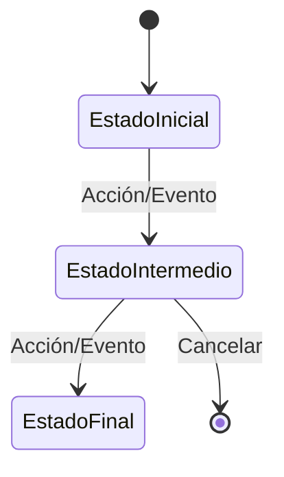

# 📚 [NOMBRE_DEL_MODELO]

> **IMPORTANTE**: 
> 1. **Verificar siempre** los archivos relacionados:
>    - `database/migrations/` (estructura de base de datos)
>    - `app/Models/` (implementación del modelo)
>    - `resources/js/types/` (tipos TypeScript)
> 2. Las migraciones son la fuente de verdad
> 3. Los modelos deben reflejar las migraciones
> 4. Los tipos TypeScript deben reflejar las migraciones y los modelos
> 5. Sin codigó explixcito

## 📌 Ubicación
- **Tipo**: Modelo
- **Archivo Principal**: `app/Models/[Nombre].php`
- **Tabla**: `[nombre_tabla]`

## 📦 Archivos Relacionados

### Migraciones
- `database/migrations/YYYY_MM_DD_HHMMSS_descriptivo_nombre_tabla.php`
  - Estructura de la tabla
  - Relaciones con claves foráneas
  - Índices y restricciones

### Modelos Relacionados
- `app/Models/RelatedModel.php`
  - Tipo de relación (hasOne, hasMany, belongsTo, belongsToMany)
  - Propósito de la relación

### Tipos TypeScript
- `resources/js/types/[ruta]/[tipo].d.ts`
  - Interfaces relacionadas
  - Tipos personalizados

## 🎯 Estados del Modelo

### Diagrama de Estados


### Transiciones y Endpoints
> **NOTA**: Los endpoints mostrados son sugerencias basadas en las mejores prácticas de REST. Si un endpoint no existe en el código, se debe marcar con el prefijo `(sugerido)`.

| Estado Actual | Evento | Nuevo Estado | Endpoint | Método |
|---------------|--------|--------------|----------|--------|
| Estado1 | Acción | Estado2 | `/api/acción` | POST |
| Estado2 | Confirmar | Estado3 | `/api/confirmar` | PUT |

**Leyenda**:
- Sin prefijo: Endpoint existente en el código
- `(sugerido)`: Endpoint recomendado pero no implementado

## Estructura

### Base de Datos (Migraciones)
- **Tabla**: `[nombre_tabla]`
- **Campos Clave**:
  - `id`: Tipo - Descripción
  - `status`: Enum - Posibles estados
  - `timestamps`: created_at, updated_at, deleted_at

### Relaciones
- **Relación con [OtraTabla]**:
  - Tipo: [1:1, 1:N, N:M]
  - Clave foránea: `[foreign_key]`
  - Comportamiento en cascada: [delete, null, restrict]

## 🔄 Flujo de Datos
1. Origen de los datos
2. Validaciones
3. Procesamiento
4. Almacenamiento
5. Respuesta

## 🔍 Ejemplo de Uso
```typescript
// Ejemplo de tipo TypeScript relacionado
interface ModeloEjemplo {
  id: number;
  // ...otros campos
}
```

[SECCIÓN OPCIONAL: ⚙️ Configuración]
- Variables de entorno relevantes
- Dependencias clave

[SECCIÓN OPCIONAL: ⚠️ Consideraciones]
- Aspectos de seguridad
- Consideraciones de rendimiento
- Limitaciones conocidas